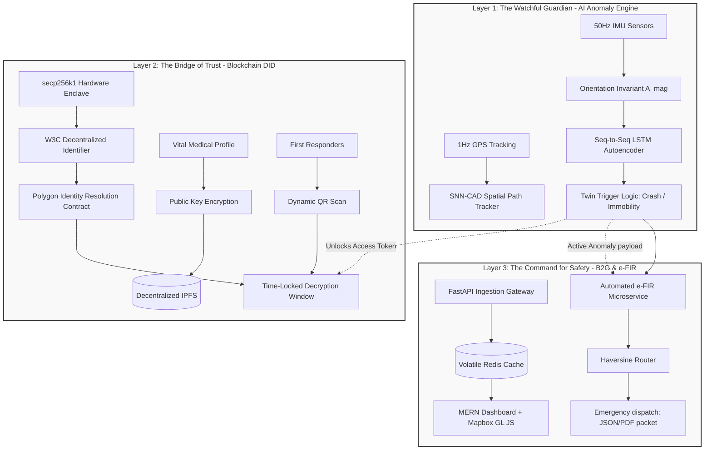
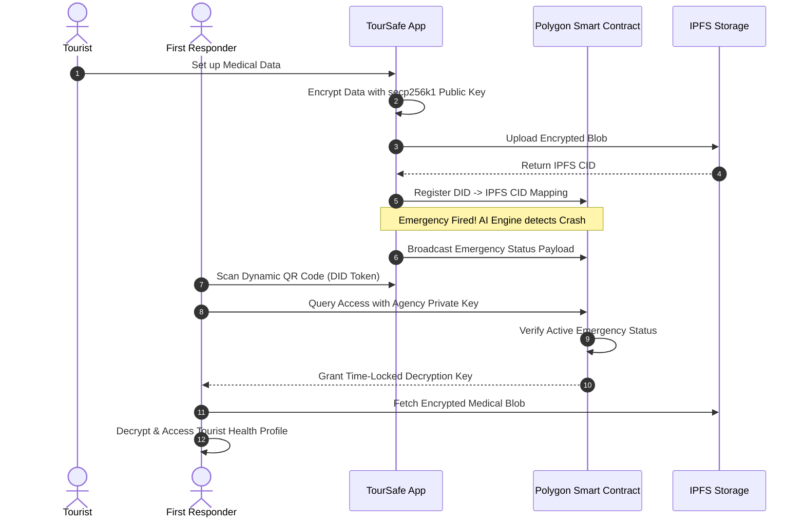

# 🛡️ TourSafe — Proactive Travel Safety & Rapid Emergency Response System

[](https://github.com/)
[](https://github.com/)
[](https://polygon.technology/)
[](https://fastapi.tiangolo.com/)
[](https://reactnative.dev/)

> 🚨 **Project Status: Under Active Construction**  
> *This repository is currently being developed as a final year capstone project. Core interfaces, machine learning pipelines, and smart contracts are under active integration.*

---

## 👥 Academic & Team Meta-Data

- **Academic Institution:** Sri Sairam Engineering College, Chennai (Department of Computer Science & Engineering)
- **Development Team:** **TriArch**
  - **SNEHA C**
  - **VISHAL L**
  - **MADHUMITHA S**
- **Core Mandate:** Architect and build a proactive travel safety ecosystem to address the global **"Golden Hour"** emergency response crisis faced by tourists.
- **Target Impact:** Reduce emergency response latency by **70%** (shrinking the window from a 20–30 minute administrative/identification delay to **under 5 minutes**).

---

## The Core Problem Statement

### 1. The Fatal "Golden Hour" Delay
In acute trauma, every minute without care drops survival odds by **7% to 10%**. Rural, coastal, and adventure tourism areas suffer Emergency Medical Services (EMS) wait times up to **3 times slower** than urban zones. This is further compounded by a **20–30 minute administrative lag** trying to identify a foreign, unresponsive, or unconscious tourist.

### 2. Predictive Blindness & Signal Gaps
Existing personal security tools rely entirely on **reactive, manual SOS buttons**. If a traveler enters a remote environment with dead cell zones, or becomes incapacitated (e.g., knocked unconscious, suffering sudden illness, drowning), traditional tracking drops completely, leaving them invisible.

### 3. The Global Identity Crisis
There are over **6,000 valid international ID document types** in circulation. Cross-border data localization laws and system fragmentation legally restrict local hospitals from instantly pulling an unknown foreigner's medical history (blood type, allergies, pre-existing conditions) during critical intake minutes.

---

## 🏗️ The 3-Layer Technological Architecture

TourSafe implements a deeply integrated, decoupled shield to secure the traveler at every step of their journey:



### 🧠 Layer 1: The Watchful Guardian (AI Anomaly Engine)

* **Multi-Sensor Data Pipeline:** The client mobile app continuously samples multi-axis Inertial Measurement Unit (IMU) data at **50Hz** and GPS coordinates at **1Hz**.
* **Orientation Invariance:** To allow the application to work flawlessly whether the phone is face-down in a pocket, held in hand, or strapped to a backpack, raw 3-axis accelerometer readings ($A_x, A_y, A_z$) are collapsed into an absolute scalar magnitude:
  $$A_{mag} = \sqrt{A_x^2 + A_y^2 + A_z^2}$$
* **Temporal Sliding Windows:** Telemetry is processed in **3-second windows** (150 data points) shifting with a **50% temporal overlap** (every 1.5 seconds) to ensure impact signatures are never cut in half at a window boundary.
* **Twin-Trigger Logic:**
  1. *High-Impact Crash:* Instantaneous $A_{mag}$ vector spike far outside normal ranges, followed by chaotic tumbling or sudden, complete stillness.
  2. *Critical Immobility:* Prolonged sensor flatlining matching Earth's static gravity vector ($\sim 9.81\text{ m/s}^2$) co-occurring with static GPS coordinates in isolated, remote zones.
* **SNN-CAD Spatial Tracker:** A complementary spatial tracking algorithm running a Sequential Nearest Neighbor model that maps real-time spatial path deviation against historical safe routes using **Hausdorff distance** calculations.

---

### ⛓️ Layer 2: The Bridge of Trust (Blockchain Decentralized Identity)

* **Consensus Network:** Anchored on the **Polygon PoS Blockchain Network** (utilizing the Amoy Testnet for development) to leverage sub-second block finality and sub-cent gas transaction costs.
* **Self-Sovereign Identity (SSI):** Implements W3C-compliant Decentralized Identifiers (DIDs) mapped via a custom Solidity Identity Resolution Smart Contract.
* **Asymmetric Key Vault:** Upon onboarding, the mobile app generates an elliptic curve key pair (**secp256k1**), locking the private key inside the device's hardware Secure Enclave. The user's vital profile (medical logs, allergies, blood type, emergency contacts) is encrypted with the public key and pinned to decentralized **IPFS** nodes.
* **Dynamic QR / Emergency Access Protocol:** The app generates a dynamic QR code on screen encoding the DID token. First responders scan this code using authorized, contract-registered agency keys. The smart contract only grants a time-locked data decryption window **if and only if** the AI anomaly engine has fired an active emergency payload for that specific user, creating an un-forgeable, audited privacy boundary.



---

### 🚨 Layer 3: The Command for Safety (B2G Dashboard & e-FIR Engine)

* **The Control Panel Core:** Built on the **MERN Stack** (MongoDB, Express.js, React.js, Node.js) paired with **Mapbox GL JS** for high-fidelity interactive spatial maps displaying real-time tourist risk layers.
* **FastAPI Streaming Gateway:** Serves as a high-concurrency ingestion server handling the incoming persistent 1Hz tracking packets using asynchronous worker channels. Live location tracking states are pushed immediately to a volatile **Redis cache** layer to allow sub-millisecond dashboard updates.
* **Automated e-FIR Microservice:** The millisecond the AI validates a threshold emergency breach, a dedicated Node.js endpoint bypasses manual filing. It runs a **Haversine Distance** routing calculation against a registry of public safety infrastructure to identify the absolute closest emergency nodes. It auto-packages the victim's decrypted identity credentials, location data, and LSTM anomaly error data logs into a standardized, machine-readable JSON/PDF package sent straight to nearby police and hospital server nodes.

---

## 📡 The Edge Fail-Safe (Offline-First Design)

To survive remote mountain trails, dense forests, or deep valleys with absolute network dead zones, TourSafe implements an aggressive data-interceptor pattern:

```
[50Hz IMU Sensors] + [1Hz GPS]
             │
             ▼
    [Connection Check] ──(Online)──> [Stream to FastAPI Ingest Engine]
             │
          (Offline)
             │
             ▼
    [AES-256-CBC Encryption]
             │
             ▼
    [Sequenced SQLite DB Queue]
             │
     (Connection Restored)
             │
             ▼
    [Chronological Cloud Flush]
```

1. **Ping Timeout:** If an internal cellular ping to the FastAPI gateway times out, the app stops attempting cloud transmission.
2. **Encrypted Buffer:** It immediately converts the telemetry packet payload into an **AES-256-CBC** encrypted blob and queues it sequentially into a local device **SQLite** database.
3. **Chronological Flush:** A background tracking task monitors connection health; the exact moment network handshake validation succeeds, an autocommit mechanism flushes the backlog to the cloud server chronologically, ensuring zero data omission.

---

## 🛠️ Complete Technology Stack

| Layer | Technology / Tool | Icon | Description / Use Case |
| :--- | :--- | :---: | :--- |
| **Frontend Mobile** | React Native (Expo) | 📱 | Cross-platform client application with file-based routing |
| **Styling** | NativeWind / Tailwind CSS | 🎨 | Responsive utility-first layouts and styling |
| **State Management**| Zustand | 📦 | Lightweight state management for auth, SOS status, and maps |
| **Ingestion Engine**| FastAPI | ⚡ | High-concurrency async location ingestion gateway |
| **Backend Core** | Node.js & Express.js | 🟢 | Server infrastructure and business logic |
| **Realtime Synch**  | Socket.io / WebSockets | 🔌 | Real-time communication between client, backend, and dashboard |
| **Cache Layer**     | Redis | 🟥 | Volatile cache for sub-millisecond location updates |
| **Primary Database**| MongoDB & Supabase | 🍃 | Persistent storage of user profiles, alerts, and incident logs |
| **Machine Learning**| TensorFlow & Keras | 🧠 | Model architecture and training (Sequence-to-Sequence Autoencoder) |
| **ML Inference**    | ONNX Runtime | ⚙️ | High-velocity runtime for compiling and executing LSTM models |
| **Spatial Engine**  | Mapbox GL JS & Turf.js| 🗺️ | Graphical maps, incident heatmaps, and spatial geofencing |
| **Blockchain**      | Polygon PoS (Amoy) | ⛓️ | Decentralized trust anchor, Smart Contracts, gas optimization |
| **Identity Standard**| W3C DIDs & Solidity | 🆔 | Self-Sovereign Identity verification |
| **Storage (Web3)**  | IPFS (Pinata/Infura) | 📦 | Decentralized hosting of encrypted tourist health profiles |
| **Local Storage**   | SQLite | 💾 | Device-local relational storage for offline buffers |
| **Encryption**      | AES-256-CBC & secp256k1 | 🔑 | Encrypting localized offline payloads and asymmetric key validation |

---

## 📁 Repository Structure

```
TourSafe-RN/
├── app/                      # Expo Router Navigation App Scaffolding
│   ├── _layout.tsx           # Global routing entry and Provider setup
│   ├── index.tsx             # Entry Screen / Role selection switchboard
│   ├── auth/                 # Authentication pages
│   │   ├── _layout.tsx       # Auth route setup
│   │   ├── login.tsx         # Login credentials input (Mock OTP)
│   │   └── register.tsx      # Registration screen with identity options
│   ├── tourist/              # Client-Side Mobile App Screens
│   │   ├── (tabs)/
│   │   │   ├── _layout.tsx   # Tourist Navigation Layout (Tabs)
│   │   │   ├── dashboard.tsx # Core tourist viewport (Anomaly details & SOS)
│   │   │   ├── map.tsx       # Local interactive Mapbox canvas
│   │   │   ├── sos.tsx       # Handshake & manual alert center (Shake-to-Alert)
│   │   │   ├── digital-id.tsx# W3C DID QR generator & Encryption status
│   │   │   ├── incidents.tsx # Localized crowd-sourced safety logs
│   │   │   └── profile.tsx   # Medical, allergy, and blood group profiles
│   ├── admin/                # Authority Dashboard / Dispatch Screens
│   │   ├── (tabs)/
│   │   │   ├── _layout.tsx   # Admin Navigation Layout (Tabs)
│   │   │   ├── dashboard.tsx # Incident summary graphs & metrics
│   │   │   ├── map.tsx       # Live Mapbox spatial heatmap layers
│   │   │   ├── alerts.tsx    # Live incoming dispatch queues & logs
│   │   │   ├── tourists.tsx  # Tracked tourist registry and risk index
│   │   │   ├── analytics.tsx # TensorFlow predictive risk outputs
│   │   │   └── zones.tsx     # Geofence boundary drawing & settings
├── components/               # Shared Reusable UI Components
│   ├── FeatureButton.tsx     # Interactive feature showcase button with state indicators
│   ├── FeatureSection.tsx    # Component grouping layout helper
│   ├── RealMap.tsx           # Cross-platform Mapbox component
│   └── RoleSwitch.tsx        # Fast-swap roles panel for development & testing
├── store/                    # Zustand Global Stores
│   ├── authStore.ts          # Handles logged-in state (Tourist / Authority)
│   ├── sosStore.ts           # Controls active alarms, sensors, & shake triggers
│   ├── alertStore.ts         # Coordinates incoming B2G alerts
│   └── mapStore.ts           # Tracks routes, markers, and historical paths
├── lib/                      # Business & Communication Utilities
│   ├── mockData.ts           # Detailed mock records for locations & tourists
│   ├── simulation.ts         # Sensor data & accident scenario simulators
│   ├── api.ts / useMockApi.ts# HTTP REST routing & mock connectors
│   └── websocket.ts          # Live bi-directional pipeline simulation
├── types/                    # System TypeScript Declarations
│   └── index.ts              # TS interfaces for User, Incident, Alert, Zone
├── package.json              # App dependencies & run scripts
└── tsconfig.json             # TypeScript compiler settings
```

---

## 🏃 Run the Frontend App Locally

Follow these steps to run the React Native / Expo prototype on your local machine:

### 1. Prerequisites
Ensure you have [Node.js](https://nodejs.org/) installed.

### 2. Clone and Setup Dependencies
Navigate to the root directory and install dependencies:
```bash
npm install
```

### 3. Setup Environment Variables
Create a `.env` file in the root folder or check `.env.example`. The app has development bypass capabilities pre-configured:
```env
EXPO_PUBLIC_DEV_BYPASS=true
```

### 4. Execute the Application
You can run TourSafe in your browser (using Expo Web) or on a mobile emulator/physical device:

* **Start in Web Mode (Recommended for testing dashboards):**
  ```bash
  npm run web
  ```
* **Start General Expo CLI (For iOS/Android Expo Go testing):**
  ```bash
  npm start
  ```

---

## 🎟️ Demo Credentials & Testing Flow

The application contains active bypass keys to allow immediate evaluation of both roles:

* **Authority / Admin Access:**
  * **Email:** `admin@toursafe.com` *(or `admin@tnpol.gov.in`)*
  * **Password:** `admin@123`
* **Client / Tourist Access:**
  * Enter any email address on the login screen.
  * Proceed using the **Mock OTP Flow** (bypass enabled).

Once inside, use the **"Features"** tab in both roles to test and inspect the interactive triggers for AI Detection, Polygon Blockchain ID verification, Geo-Fencing alerts, Offline Queues, and automated legal dispatch.

---

## 📊 Agile 4-Sprint Implementation Flow

```
┌───────────────────────────────────────┐
│ SPRINT 1: Infrastructure Foundations   │
│ - Docker Compose for FastAPI, Redis   │
│ - React Native / Expo Setup           │
│ - Mapbox UI Canvas integration        │
└──────────────────┬────────────────────┘
                   │
                   ▼
┌───────────────────────────────────────┐
│ SPRINT 2: Sensor Pipelines & Edge     │
│ - 50Hz Ring Buffer implementation     │
│ - AES-256 local SQLite Queue          │
│ - Turf.js Geo-Fencing algorithms      │
└──────────────────┬────────────────────┘
                   │
                   ▼
┌───────────────────────────────────────┐
│ SPRINT 3: Machine Learning Execution  │
│ - Sequence-to-Sequence LSTM Training  │
│ - ONNX compilation & Edge deployment  │
│ - Socket.io live dashboard listeners  │
└──────────────────┬────────────────────┘
                   │
                   ▼
┌───────────────────────────────────────┐
│ SPRINT 4: Blockchain & Automation     │
│ - Solidity contracts on Polygon Amoy  │
│ - IPFS storage connection             │
│ - Automated Haversine e-FIR module    │
└───────────────────────────────────────┘
```

---

## 💼 Commercial Model & Growth Matrix

### 🏛️ Primary (B2G Governance Model)
Enterprise annual licensing of the Command Dashboard software to state tourism boards, police departments, and public sector municipal frameworks at **₹2,0,00,000 (₹2 Crore) per year per designated Safe Zone**.

### ✈️ Secondary (B2B Travel Channel Integration)
A per-trip user onboarding commission model built into third-party travel platforms (MakeMyTrip, Booking.com, redBus), tour operators, and travel agencies at **₹499 per tourist per trip**.

### 🌍 Global SDG Alignment
TourSafe aligns with the United Nations Sustainable Development Goals:
* **SDG 8 (Decent Work & Economic Growth):** Securing tourists to promote stable, resilient destinations and support local economies.
* **SDG 11 (Sustainable Cities & Communities):** Enhancing public safety networks and response frameworks.
* **SDG 16 (Peace, Justice & Strong Institutions):** Automating reporting (e-FIR) to increase institutional legal transparency and reduce corruption/delay.
