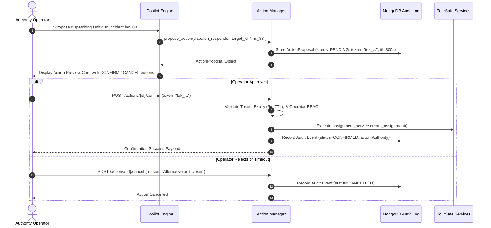

# TourSafe Authority AI Copilot Policy & Decision Support Governance

## 1. Executive Summary & Philosophy

The TourSafe Authority AI Copilot is an **agentic decision-support system** engineered specifically for tourism safety authorities, emergency dispatch supervisors, and administrative personnel.

> [!IMPORTANT]
> **Core Principle: Decision Support, Not Autonomous Authority**
> The AI Copilot is strictly a **decision-support copilot**, NOT an autonomous authority. It provides real-time situational synthesis, data-grounded summaries, policy citations, and structured action proposals. It is strictly prohibited from taking autonomous actions on live operational infrastructure.

---

## 2. Allowed vs. Prohibited AI Capabilities

```
+-----------------------------------------------------------------------------+
|                         OPERATIONAL BOUNDARY MATRIX                         |
+-----------------------------------------------------------------------------+
|  ALLOWED (Read-Only & Suggestive)        |  PROHIBITED (Blocked / Autonomy) |
|------------------------------------------|----------------------------------|
|  * Query active incidents & summaries    |  * Autonomous responder dispatch |
|  * Filter tourists in high-risk zones   |  * Autonomous zone status change |
|  * Explain anomaly elevation reasons     |  * Autonomous policy override    |
|  * Retrieve active SOPs and policies     |  * Direct SQL/Mongo raw commands |
|  * Synthesize multi-source sitreps       |  * Unbounded terminal execution  |
|  * Propose structured action cards       |  * Unauthenticated tool calls    |
|  * Track responder ETA and availability  |  * Disclosing unmasked tourist   |
|  * Recommend response plan adjustments   |    identities, phones, or emails |
+-----------------------------------------------------------------------------+
```

---

## 3. Human-in-the-Loop Confirmation Lifecycle

Every state-altering operation proposed by the AI Copilot follows a strict cryptographic preview and confirmation workflow:



### 3.1 Expiry & Idempotency Rules
1. **5-Minute TTL**: Confirmation tokens expire automatically after 300 seconds. Expired tokens cannot execute.
2. **Idempotency**: Repeated confirmation of an already-executed action returns the cached execution result with `idempotent: true` and does not duplicate side effects.
3. **Role Enforcement**: Only operators with `authority` or `admin` roles matching the target jurisdiction can confirm action tokens.

---

## 4. Multi-Jurisdictional Isolation & RBAC

The AI Copilot strictly enforces jurisdiction partitioning:
- Authorities assigned to a specific jurisdiction (e.g., `jur_goa_north`) can only execute tools and query data within their assigned boundary.
- RAG policy retrieval filters documents scoped to the authority's jurisdiction or marked universal.
- Super-administrators (`admin` role) have platform-wide observability and cross-jurisdictional query capabilities.

---

## 5. Auditability & Explainability

All Copilot interactions generate immutable records in the `copilot_audit_events` collection:
- Full tool invocation trace with sanitized inputs and outputs.
- Grounding citations for every factual statement.
- Latency and token accounting per turn.
- User feedback (thumb up/down, corrections) linked directly to the specific response message.
