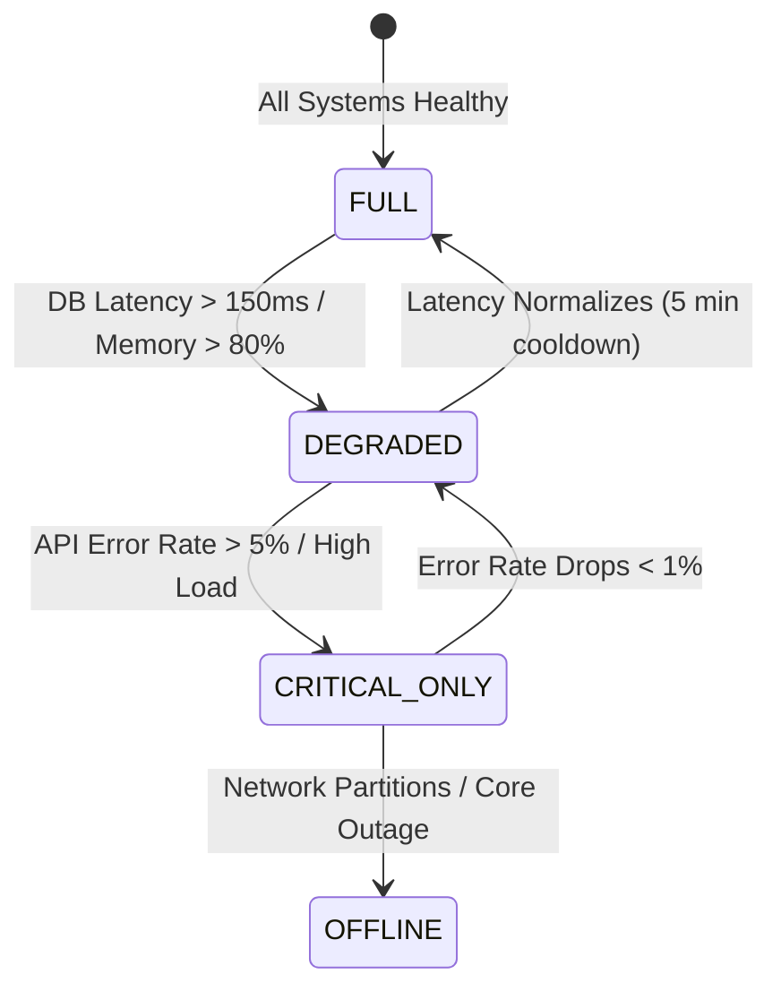

# Reliability & High Availability Results

## 1. SRE Golden Signals & Monitoring
TourSafe provides real-time health monitoring and automated circuit breakers:

- **Liveness & Readiness Probes**:
  - `/health/live`: Fast process health check (< 2ms response).
  - `/health/ready`: Deep dependency readiness check (Postgres, Redis, Realtime Bus, Model Registry).
  - `/health/startup`: Initialization validation probe.

---

## 2. Graceful Degradation State Machine

The system dynamically adapts to infrastructure pressure across 4 operational modes:

### Operational Modes:
1. **`FULL`**: All services active (50Hz telemetry, real-time LSTM anomaly inference, spatial queries, AI Copilot).
2. **`DEGRADED`**: Telemetry sampling reduced from 50Hz to 10Hz; AI Copilot responses cached; non-critical analytics paused.
3. **`CRITICAL_ONLY`**: Non-essential endpoints load-shed; all compute reserved strictly for SOS Emergency Ingestion and Live Responder Dispatch.
4. **`OFFLINE`**: Local device edge inference and offline queue active; emergency fallback to cellular SMS broadcast.

---

## 3. High-Availability & Disaster Recovery
- **Recovery Time Objective (RTO)**: $< 2$ minutes (automated Kubernetes replica failover and Redis snapshot rebuilder).
- **Recovery Point Objective (RPO)**: $< 1$ second (WAL archiving and streaming replication).
