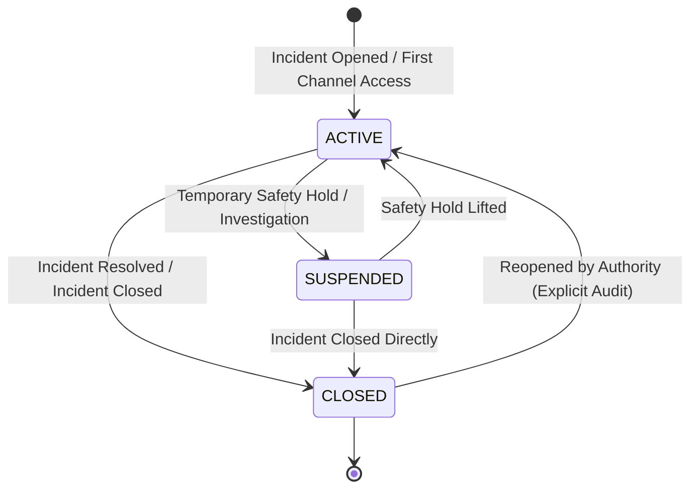
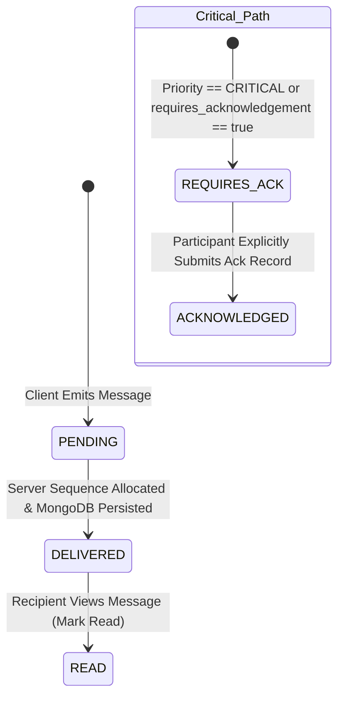
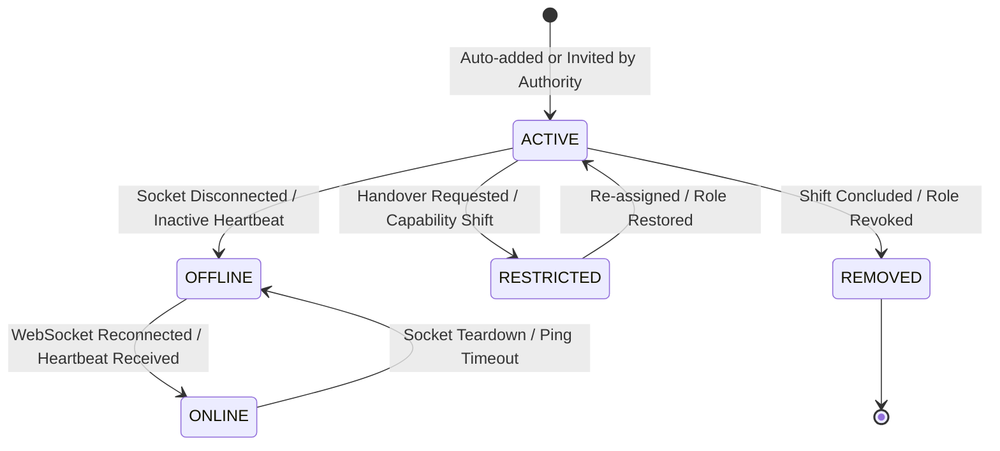

# TourSafe Communication State Machine & Lifecycle Transitions

## Overview

The TourSafe Communication State Machine formalizes the states, transitions, preconditions, and invariant guarantees for incident communication channels, message deliveries, and participant statuses.

---

## 1. Incident Channel State Machine

### Channel State Transitions

| From State | To State | Trigger | Authorized Actors | Effects & Invariants |
| :--- | :--- | :--- | :--- | :--- |
| `[*]` | `ACTIVE` | Incident created or accessed | System / Authority / Tourist | Channel initialized, monotonic sequence counter at 0, reporting tourist auto-added as active participant. |
| `ACTIVE` | `SUSPENDED` | Temporary communication pause | Authority | New messages paused except high-priority system alerts. |
| `SUSPENDED` | `ACTIVE` | Communication resume | Authority | Channel active; normal messaging resumes. |
| `ACTIVE` | `CLOSED` | Incident resolved / closed | Authority / System | Channel becomes read-only; new operational messages rejected with HTTP 400. `closed_at` timestamp recorded. |
| `CLOSED` | `ACTIVE` | Incident reopened | Authority Admin | Channel reopened; sequence counter continues monotonically without resetting. |

---

## 2. Message Delivery & Acknowledgement State Machine

### Message State Transitions

| State | Definition | Transition Trigger | Verification Method |
| :--- | :--- | :--- | :--- |
| `PENDING` | Client has generated message locally with `client_message_id`. | Message send initiated over REST/WebSocket. | Client local queue. |
| `DELIVERED` | Server validated idempotency, sanitized HTML, allocated monotonic `server_sequence`, and persisted record. | MongoDB `incident_messages.insert_one()` completed. | `server_sequence > 0`, `delivery_status = 'DELIVERED'`. |
| `READ` | One or more participants have received and rendered message. | Participant issues `POST /api/v1/incidents/{id}/messages/{msg_id}/read`. | `read_by[user_id] = ISO_TIMESTAMP`. |
| `ACKNOWLEDGED` | Critical instruction has been explicitly confirmed by target human actor (e.g. Tourist or Responder). | Participant issues `POST /api/v1/incidents/{id}/messages/{msg_id}/acknowledge` with optional tactical notes. | `acknowledged_by` array contains `MessageAcknowledgementRecord`. |

> [!IMPORTANT]
> **READ != ACKNOWLEDGED**: A message marked as `READ` merely signifies visual delivery. Critical tactical directions (e.g., "EVACUATE IMMEDIATELY") strictly require an explicit `ACKNOWLEDGED` transition.

---

## 3. Participant Lifecycle State Machine

### Participant States

- `ACTIVE`: Fully authenticated participant eligible to read and send operational messages subject to role permissions.
- `RESTRICTED`: Participant undergoing operational handover or temporary suspension; retains read access to channel history but cannot emit new instructions.
- `REMOVED`: Participant departed from incident operations; omitted from active subscriber distributions.
