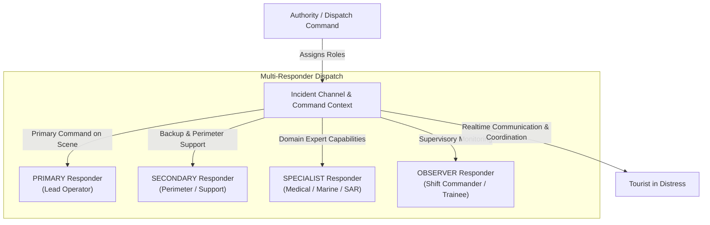
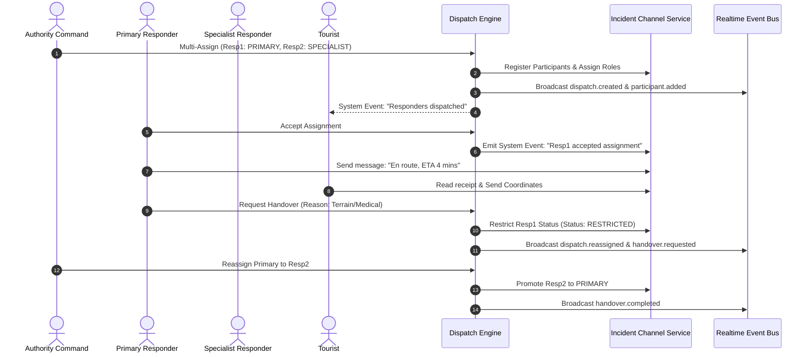

# TourSafe Dispatch Architecture

## Overview

The TourSafe Dispatch and Multi-Responder Coordination Architecture orchestrates emergency dispatch operations across multiple specialized responders, command authorities, and tourists in distress. It delivers an end-to-end multi-role dispatch system that coordinates primary responders, secondary units, and domain specialists (medical, search and rescue, marine, tactical) within a unified incident command environment.

---

## 1. Multi-Responder Role Topology

Modern emergency operations require multi-tiered responder deployments rather than single-operator assignment. TourSafe models four explicit responder roles:

### Role Taxonomy

| Role | Responsibilities | Channel Permissions | Handover Eligibility |
| :--- | :--- | :--- | :--- |
| **PRIMARY** | Scene lead, primary contact with tourist, primary updater of scene assessments and lifecycle transitions. | `SEND_MESSAGE`, `SEND_LOCATION`, `SEND_ATTACHMENT`, `ACKNOWLEDGE_MESSAGES`, `INITIATE_HANDOVER` | May request operational handover |
| **SECONDARY** | Perimeter containment, logistics support, crowd management, backup assistance. | `SEND_MESSAGE`, `SEND_LOCATION`, `SEND_ATTACHMENT`, `ACKNOWLEDGE_MESSAGES` | May be promoted to Primary |
| **SPECIALIST** | Medical triage, technical mountain rescue, diving/marine operations, language translation. | `SEND_MESSAGE`, `SEND_LOCATION`, `SEND_ATTACHMENT`, `ACKNOWLEDGE_MESSAGES` | Specialized execution |
| **OBSERVER** | Situational awareness, trainee oversight, cross-jurisdictional monitoring. | Read-only channel access (`READ_MESSAGES`) | Non-operational |

---

## 2. Dispatch Lifecycle & State Machine

---

## 3. Atomic Assignment Locking & Concurrency Control

To prevent race conditions where multiple dispatchers assign the same responder simultaneously:

1. **MongoDB Optimistic & Atomic Locking**:
   - Responders transition to `ASSIGNED` using atomic compare-and-swap (`find_one_and_update({"responder_id": id, "status": "AVAILABLE"}, {"$set": {"status": "ASSIGNED"}})`).
   - If the responder's status has already shifted, the atomic query returns `None`, rejecting the concurrent assignment request.
2. **Channel Sequence Integration**:
   - Every dispatch lifecycle event allocates a monotonic channel sequence integer, ensuring events appear in absolute chronological order across all subscriber nodes.

---

## 4. Operational Handover Protocol

When a responder encounters barriers preventing mission completion (e.g., medical escalation, shift expiration, inaccessible terrain):

1. **Handover Initiation**: Responder issues `AssignmentHandoverRequest` specifying reason (`CAPABILITY`, `MEDICAL`, `TERRAIN`, `EQUIPMENT`, `SHIFT_CHANGE`, `OVERLOAD`).
2. **Channel Status Restriction**: The outgoing responder's channel status is transitioned to `RESTRICTED`, maintaining historical visibility while revoking primary command actions.
3. **Audit & System Notification**: An immutable timeline record and channel system message are generated immediately.
4. **Authority Reassignment**: Dispatch authorities receive high-priority alerts with capability recommendations to assign replacement or specialist units.

---

## 5. Security & RBAC Isolation

- **Authority Access**: Full administrative dispatch control across all regional incidents.
- **Responder Access**: Scoped strictly to incidents where the responder has an active or past assignment.
- **Tourist Access**: Scoped exclusively to the tourist's own incident; cannot view responder identifiers outside assigned dispatch units.
