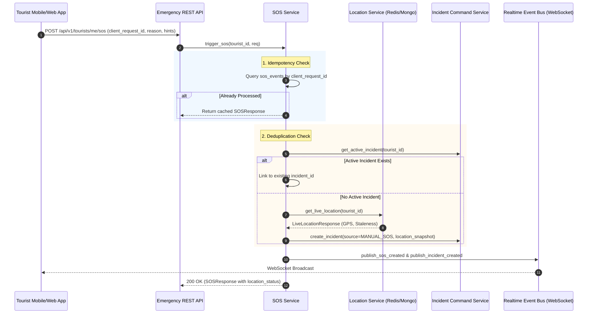

# TourSafe Emergency Response & Incident Command Architecture

## 1. System Overview & Executive Summary

The **TourSafe Emergency Response & Incident Command Subsystem** provides a mission-critical, human-in-the-loop operational response engine. Building directly upon Prompt 11's Safety Orchestration Engine (which determines *"An incident condition exists"*), Prompt 12 operationalizes *"What happens operationally after an incident condition exists?"*.

### Core Operational Principles
1. **Strict Human-in-the-Loop Authorization**: Algorithmic triggers (geofence breaches, ML anomalies, safety engine rules) or manual SOS signals generate an `OPEN` incident condition. **No AI model or background worker autonomously dispatches external armed services or emergency personnel without explicit human authority command assessment and authorization.**
2. **Honest Provider Abstractions**: Production execution never pretends external carrier SMS gateways, push networks, or municipal emergency services were contacted when unconfigured. Providers explicitly declare `NOT_CONFIGURED` or `DEVELOPMENT` modes rather than fabricating dispatch records.
3. **Append-Only Immutable Auditability**: Every state transition, operational note, assignment, escalation, and resolution creates an immutable `TimelineEventRecord` and `IncidentNoteRecord` with actor identity, timestamps, state deltas, and operational rationale.
4. **Optimistic Concurrency Control**: All state mutation commands enforce mandatory version checks (`version` integer) to protect against concurrent operator race conditions in multi-dispatcher emergency command centers.
5. **Authoritative Server GPS Resolution**: In manual SOS requests, client-supplied GPS coordinates are treated as secondary hints; the server verifies the latest authoritative GPS fix from `LocationService`, explicitly evaluating temporal staleness (`CURRENT`, `STALE`, or `NO_GPS`).

---

## 2. Incident Lifecycle State Machine

### Allowed State Transition Matrix
TourSafe strictly enforces the following transition rules. Any disallowed state transition raises a deterministic `400 Bad Request` validation error.

```
                  +----------------------------------------------+
                  |                                              |
                  v                                              |
 [ OPEN ] ---> [ ACKNOWLEDGED ] ---> [ ASSESSING ] ---> [ ASSIGNED ] ---> [ RESPONDING ]
    |                 |                   |                   |                 |
    |                 +-------------------+-------------------+                 |
    |                                     |                                     |
    |                                     v                                     |
    |                             [ ESCALATED ]                                 |
    |                                     |                                     |
    |                 +-------------------+-------------------+                 |
    |                 v                                       v                 v
    +---------> [ CANCELLED ] <------------------------ [ RESOLVED ] <----------+
                      |                                       |
                      +-------------------+-------------------+
                                          v
                                      [ CLOSED ] (Terminal)
```

| Source State | Allowed Destination States | Operational Trigger |
| :--- | :--- | :--- |
| **`OPEN`** | `ACKNOWLEDGED`, `ASSESSING`, `CANCELLED` | Incident created by Safety Engine or Tourist Manual SOS. Awaiting operator acknowledgment or tourist self-cancellation. |
| **`ACKNOWLEDGED`**| `ASSESSING`, `ASSIGNED`, `RESPONDING`, `ESCALATED`, `RESOLVED`, `CANCELLED` | Authority operator accepts incident ownership. |
| **`ASSESSING`** | `ASSIGNED`, `RESPONDING`, `ESCALATED`, `RESOLVED`, `CANCELLED` | Authority evaluating situation, sensor telemetry, drone feeds, or severity classification. |
| **`ASSIGNED`** | `RESPONDING`, `ESCALATED`, `RESOLVED`, `CANCELLED` | Specific field unit, patrol vehicle, or medical responder designated. |
| **`RESPONDING`** | `ESCALATED`, `RESOLVED`, `CANCELLED` | Designated unit en route or actively engaging tourist on site. |
| **`MONITORING`** | `ACKNOWLEDGED`, `ASSESSING`, `ASSIGNED`, `RESPONDING`, `RESOLVED`, `CANCELLED` | Safety engine background state monitoring. |
| **`ESCALATED`** | `ASSIGNED`, `RESPONDING`, `RESOLVED`, `CANCELLED` | Tiered escalation triggered via durable timeout or manual authority override. |
| **`RESOLVED`** | `CLOSED` | Situation addressed with mandatory `ResolutionCategory` and rationale. |
| **`CANCELLED`** | `CLOSED` | Tourist cancelled with explanation or authority marked as `FALSE_ALARM`. |
| **`CLOSED`** | *(None - Terminal)* | Final operational review completed; incident archived. |

---

## 3. Manual SOS Ingestion & Idempotency Pipeline

When a tourist triggers the SOS button (or sends a hardware beacon):



### Staleness & Location Verification
- **`CURRENT`**: GPS fix updated $\le 60$ seconds ago (Redis live cache hit or fresh GPS sample).
- **`STALE`**: GPS fix older than 60 seconds.
- **`NO_GPS` / `CLIENT_HINT`**: No server GPS fix exists; unverified client-transmitted coordinates recorded with explicit `CLIENT_HINT` warning flag.

---

## 4. Concurrency Protection: Optimistic Locking

To prevent race conditions when multiple operators in an emergency command room view and interact with the same incident simultaneously:

1. Every `IncidentRecord` maintains an integer `version` field starting at `1`.
2. Every state mutation endpoint accepts an optional `version` parameter in the request payload.
3. If `expected_version` is provided and does not match `incident.version`, the mutation is rejected immediately with HTTP `400 Bad Request`:
   ```json
   {
     "detail": "Optimistic lock conflict: expected version 2, found 3. Refresh incident state."
   }
   ```
4. On every successful mutation, `incident.version` increments atomically by `+1`.

---

## 5. Durable Escalation Engine

TourSafe provides a policy-driven escalation engine governed by versioned YAML configurations (`emergency_escalation_v1.yaml`):

```yaml
version: "v1.0.0"
policy_name: "standard_emergency_escalation"
sla_thresholds_seconds:
  acknowledgement_timeout: 120    # 2 minutes to acknowledge OPEN incidents
  assignment_timeout: 300         # 5 minutes to assign responder
  response_timeout: 600           # 10 minutes to begin response

stages:
  - stage: 1
    trigger_after_seconds: 120
    condition: "status == 'OPEN'"
    actions:
      - elevate_severity: "HIGH"
      - transition_status: "ESCALATED"
      - notify_roles: ["authority", "watch_commander"]
```

### Escalation Idempotency
To prevent repeated notification storms when background evaluation sweeps execute across open incidents:
- Every execution generates a deterministic idempotency key:
  $$\text{Key} = \text{incident\_id} + \text{":"} + \text{stage\_number} + \text{":"} + \text{policy\_version}$$
- The key is recorded in `incident.escalation_history`.
- Subsequent sweeps inspect `escalation_history` and skip already applied stages.

---

## 6. Notification Abstraction & Honest Reporting

TourSafe provides an extensible provider framework with honest delivery tracking:

```
                  +--------------------------------+
                  |      NotificationService       |
                  +---------------+----------------+
                                  |
         +------------------------+------------------------+
         |                        |                        |
+--------v---------+    +---------v--------+    +----------v---------+
| PushNotification |    | SMSNotification  |    | EmailNotification  |
| Provider (FCM)   |    | Provider (Twilio)|    | Provider (SMTP)    |
+------------------+    +------------------+    +--------------------+
```

### Honest Status Reporting Matrix
- **`NOT_CONFIGURED`**: Provider is registered but missing API credentials or production gateway tokens.
- **`DEVELOPMENT`**: Development test runner simulated dispatch.
- **`SENT`**: Successfully handed off to confirmed gateway API.
- **`FAILED`**: Gateway error or invalid phone/email format.

### Emergency Contact Dispatch Policy
High-severity (`HIGH`, `CRITICAL`) incidents evaluate registered tourist emergency contacts and dispatch SMS and Email notifications containing incident references, emergency contact names, and authority operational links.

---

## 7. Responder Coordination & Field Unit Lifecycle

TourSafe manages dedicated field units and responders through `ResponderService`:
- **Responder Types**: `FIELD_RESPONDER`, `PARAMEDIC`, `POLICE_OFFICER`, `DRONE_OPERATOR`, `RANGER`, `TOUR_LEADER`.
- **Availability States**: `AVAILABLE`, `ASSIGNED`, `OFFLINE`, `RESTING`.
- **Atomic Release**: When an incident reaches `RESOLVED` or `CANCELLED`, any assigned responder is automatically transitioned back to `AVAILABLE` with active incident linkage cleared.

---

## 8. Real-Time WebSocket Event Architecture

Emergency events are published across the authenticated WebSocket event bus to both authority command consoles (`authority:operations`) and the tourist channel (`tourist:{tourist_id}`):

| Event Type | Target Channel | Description |
| :--- | :--- | :--- |
| `sos.created` | `authority:operations`, `tourist:{id}` | Manual SOS triggered by tourist |
| `sos.cancelled` | `authority:operations`, `tourist:{id}` | Tourist cancelled SOS with explanation |
| `incident.created` | `authority:operations`, `tourist:{id}` | New incident created |
| `incident.acknowledged`| `authority:operations`, `tourist:{id}` | Authority operator accepted incident |
| `incident.assessing` | `authority:operations` | Incident triage in progress |
| `incident.assigned` | `authority:operations`, `tourist:{id}` | Field responder assigned |
| `incident.response.started`| `authority:operations`, `tourist:{id}` | Responder en route |
| `incident.escalated` | `authority:operations` | SLA breached or manual escalation |
| `incident.note.added` | `authority:operations` | Operator note appended to thread |
| `incident.resolved` | `authority:operations`, `tourist:{id}` | Incident resolved safely |
| `incident.cancelled` | `authority:operations`, `tourist:{id}` | False alarm or incident cancelled |
| `incident.closed` | `authority:operations` | Incident archived and closed |

---

## 9. Comprehensive REST API Reference

### Tourist Endpoints
- `POST /api/v1/tourists/me/sos` - Initiate manual SOS with idempotency key and category.
- `POST /api/v1/tourists/me/sos/{sos_id}/cancel` - Cancel manual SOS with mandatory explanation.
- `GET /api/v1/tourists/me/sos/active` - Fetch current active SOS record.
- `POST /api/v1/sos/trigger` - Convenience alias for manual SOS.

### Authority Incident Command Endpoints
- `GET /api/v1/authority/incidents/metrics` - Aggregated operational metrics (mean time to acknowledge, mean time to resolve, false alarm rate).
- `GET /api/v1/authority/incidents` - Query incidents with multi-parameter filtering (`status`, `severity`, `source`, `tourist_id`, `search`, pagination).
- `GET /api/v1/authority/incidents/{incident_id}` - Fetch incident record with optimistic locking version.
- `GET /api/v1/authority/incidents/{incident_id}/timeline` - Chronological audit events.
- `POST /api/v1/authority/incidents/{incident_id}/acknowledge` - Transition `OPEN` $\to$ `ACKNOWLEDGED`.
- `POST /api/v1/authority/incidents/{incident_id}/assess` - Transition to `ASSESSING`.
- `POST /api/v1/authority/incidents/{incident_id}/assign` - Transition to `ASSIGNED` with designated responder.
- `POST /api/v1/authority/incidents/{incident_id}/response-start` - Transition to `RESPONDING`.
- `POST /api/v1/authority/incidents/{incident_id}/escalate` - Transition to `ESCALATED`.
- `POST /api/v1/authority/incidents/{incident_id}/notes` - Append immutable operational note.
- `POST /api/v1/authority/incidents/{incident_id}/resolve` - Transition to `RESOLVED` with category and reason.
- `POST /api/v1/authority/incidents/{incident_id}/cancel` - Transition to `CANCELLED` (or false alarm).
- `POST /api/v1/authority/incidents/{incident_id}/close` - Transition to `CLOSED` (terminal archive).

### Responder Endpoints
- `GET /api/v1/authority/responders` - List responders with status and type filters.
- `POST /api/v1/authority/responders` - Register new responder unit and capabilities.
- `GET /api/v1/authority/responders/{responder_id}` - Fetch responder status.
- `PATCH /api/v1/authority/responders/{responder_id}` - Update responder availability and status.
