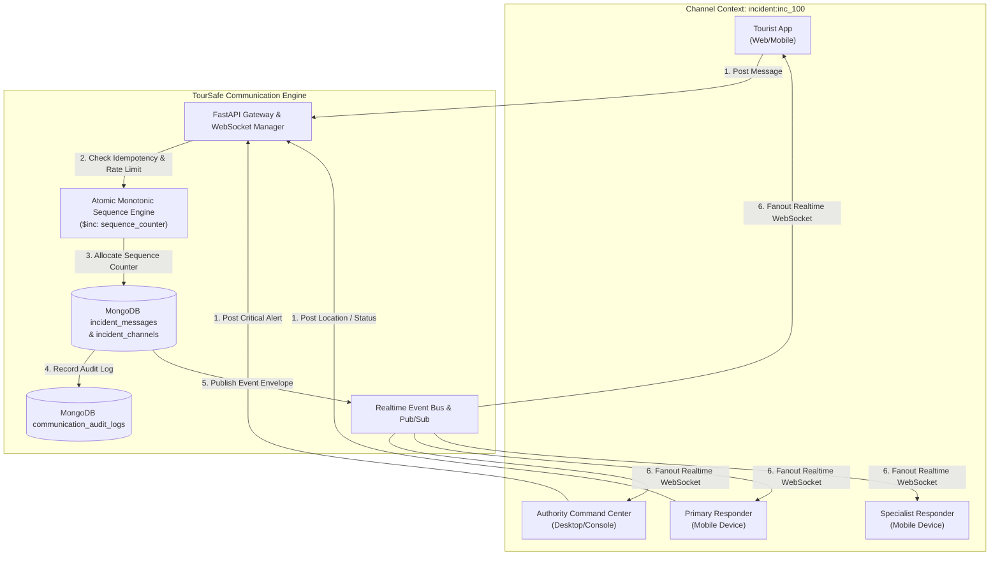

# TourSafe Incident Communication Architecture

## Overview

The TourSafe Incident Communication Platform provides a fault-tolerant, strictly ordered, multi-party messaging infrastructure connecting Authorities, Responders, and Tourists during active incidents.

---

## 1. Architectural Core Principles

1. **Incident-Scoped Isolation**: Every incident generates an isolated communication channel (`chn_<id>`). Participants can only communicate within the context of their authorized incident.
2. **Strict Monotonic Sequence Ordering**: Every message within an incident channel receives an atomic, strictly increasing server integer sequence (`1, 2, 3, ...`) using MongoDB `$inc`. This eliminates timestamp drift ambiguities and allows deterministic client message reconciliation.
3. **Client Idempotency**: Messages support client-provided UUIDs (`client_message_id`). Retries due to network fluctuation return the existing message record without duplicate creation or sequence advancement.
4. **Separation of Read Receipts vs Critical Acknowledgements**:
   - **Read Receipts (`read_by`)**: Implicit/explicit acknowledgment of message rendering on a client device.
   - **Operational Acknowledgement (`acknowledged_by`)**: Explicit human confirmation (with optional tactical notes) required for `CRITICAL` safety instructions.
5. **Sequence Gap Recovery**: Reconnecting clients supply their last known server sequence (`since_sequence`) to backfill all intermediate messages, state transitions, and acknowledgements.
6. **Cross-Site Scripting (XSS) Sanitization**: All incoming text is sanitized with strict HTML entity escaping prior to storage and broadcast.
7. **Rate Limiting Protection**: 30 messages/minute sliding-window rate limiting prevents denial-of-service or chat flooding during chaotic operations.

---

## 2. Channel Topology & Message Flow



---

## 3. Data Models & Schemas

### Incident Channel Record

```json
{
  "channel_id": "chn_9a8b7c6d5e4f",
  "incident_id": "inc_100",
  "status": "ACTIVE",
  "sequence_counter": 14,
  "version": 1,
  "created_at": "2026-08-22T06:00:00Z",
  "updated_at": "2026-08-22T06:05:30Z",
  "closed_at": null
}
```

### Incident Message Record

```json
{
  "message_id": "msg_f1e2d3c4b5a6",
  "channel_id": "chn_9a8b7c6d5e4f",
  "incident_id": "inc_100",
  "sender_id": "usr_auth_01",
  "sender_role": "AUTHORITY",
  "sender_name": "Commander Singh",
  "message_type": "TEXT",
  "priority": "CRITICAL",
  "content": "DO NOT MOVE: Water levels rising, stay on high ground.",
  "client_message_id": "cli_uuid_89374829",
  "server_sequence": 12,
  "delivery_status": "DELIVERED",
  "requires_acknowledgement": true,
  "read_by": {
    "usr_auth_01": "2026-08-22T06:04:10Z",
    "usr_tourist_1": "2026-08-22T06:04:15Z"
  },
  "acknowledged_by": [
    {
      "actor_id": "usr_tourist_1",
      "actor_role": "TOURIST",
      "actor_name": "Alice Tourist",
      "acknowledged_at": "2026-08-22T06:04:20Z",
      "notes": "Understood, I am on the concrete platform."
    }
  ],
  "location_data": null,
  "attachment_data": null,
  "created_at": "2026-08-22T06:04:10Z",
  "updated_at": "2026-08-22T06:04:20Z",
  "deleted_at": null
}
```

---

## 4. Reconnect & Sequence Gap Recovery Protocol

When mobile devices experience intermittent connectivity (cellular dead zones, tunnels, high terrain):

1. **Client Disconnect**: Client stores its highest received sequence `N` (e.g. `server_sequence = 10`).
2. **Channel Progression**: Other actors continue posting messages up to sequence `N + K` (e.g. sequence `15`).
3. **Client Reconnect**:
   - Client reconnects WebSocket and requests `POST /api/v1/incidents/{id}/gap-recovery?since_sequence=10`.
   - Backend returns messages with sequence numbers `[11, 12, 13, 14, 15]`.
   - Client updates local state without duplicate entries or missing records.
4. **Snapshot Fallback**: If sequence gap exceeds 500 messages, client fetches full snapshot `GET /api/v1/incidents/{id}/channel`.

---

## 5. Security & Rate Limiting

- **Closed Channel Immutability**: Once an incident is marked `RESOLVED` or `CLOSED`, the communication channel transitions to `CLOSED`. Any attempt to post new messages is rejected with HTTP 400.
- **Audit Trails**: Every message creation, read receipt, participant update, and acknowledgement writes an immutable audit record to `communication_audit_logs`.
- **Role Permissions**: Participants possess granular permissions (`SEND_MESSAGE`, `SEND_LOCATION`, `SEND_ATTACHMENT`, `ACKNOWLEDGE_MESSAGES`, `MANAGE_PARTICIPANTS`, `CLOSE_CHANNEL`).
