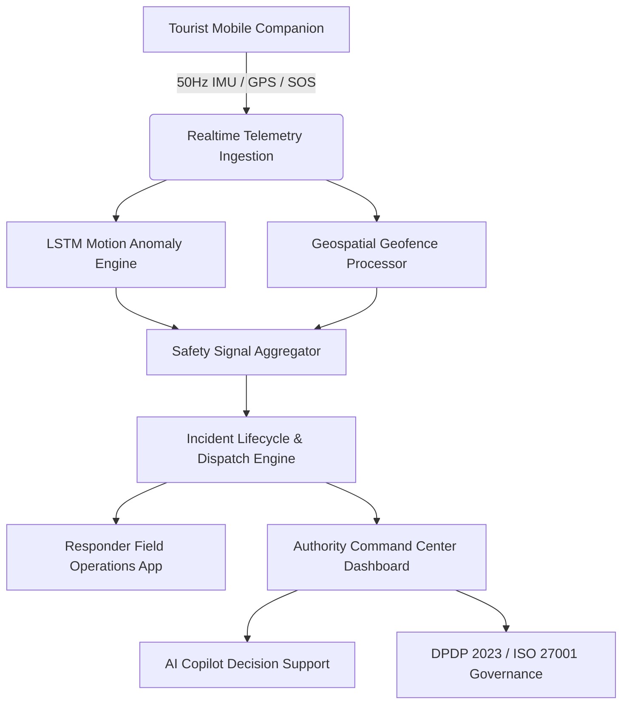

# TourSafe B2G Government Safety & Incident Command Platform

## Product Overview

**TourSafe** is a mission-critical, enterprise-grade Government-to-Government (B2G) and Government-to-Citizen (G2C) tourist safety and real-time incident command platform. Designed for district tourism authorities, emergency response units, and state policing agencies, TourSafe delivers an end-to-end safety lifecycle encompassing cryptographic identity issuance, high-frequency IMU kinematics anomaly detection, geospatial geofence containment, multi-tier automated dispatch orchestration, DPDP Act 2023 / ISO 27001 sovereign privacy governance, and grounded AI decision support.

---

## Architecture & Subsystems

### Core Portals & Personas

1. **Authority Command & Control Center (`/admin/(tabs)/dashboard`)**:
   - Live geospatial situational awareness map with dynamic clustered tourist, responder, and hazard layers.
   - Real-time incident triage, responder automated routing (Haversine/ETA), and multi-agency dispatch.
   - Grounded AI Copilot for operational intelligence, SOP lookup, and single-click incident escalation.
   - DPDP Act 2023 sovereign privacy dashboard, legal hold manager, and ISO 27001 readiness audit export.

2. **Tourist Safety Companion (`/tourist/(tabs)/dashboard`)**:
   - Instant 1-touch Emergency SOS with physical countdown and vibration feedback.
   - Verifiable W3C TSQR Digital Tourist Credential for rapid checkpoint access.
   - Real-time geofence warning alerts (safe, warning, danger, restricted zones).
   - DPDP Sovereign Privacy Center: granular consent toggles, DSR submission, and data portability bundle export.

3. **Field Responder Operations (`/responder`)**:
   - Live tactical dispatch queue with mission assignment notifications.
   - Turn-by-turn routing to incident coordinates, tourist battery/telemetry diagnostics, and field note sync.
   - Offline-capable tactical updates with automatic reconciliation upon network restoration.

---

## Key Technical Specifications

| Parameter | Specification | Standard |
| :--- | :--- | :--- |
| **Telemetry Sampling** | 50 Hz Accelerometer & Gyroscope | High-Frequency Kinematic Ingestion |
| **Motion Anomaly Engine** | Bidirectional LSTM Model | Fall, Impact, and Inactivity Inference |
| **Geospatial Engine** | PostGIS & R-Tree Spatial Indexing | Hazard Perimeter & Safe Corridor Containment |
| **Realtime Protocol** | WebSocket & Supabase Realtime Channels | Sub-100ms Event Dispatch |
| **Compliance & Privacy** | DPDP Act 2023, ISO 27001, GDPR DSR | Privacy-by-Design, Automated Retention & Holds |
| **Frontend Framework** | React Native + Expo v52 (Universal Web/Native) | NativeWind v4, Lucide Iconography, Leaflet Web Map |
| **Backend Framework** | FastAPI (Python 3.12+), PostgreSQL/PostGIS, Redis | Async ASGI, Pydantic V2, Pytest (510+ Tests) |

---

## Directory Structure

- `docs/product/workflows.md`: Detailed end-to-end operational workflows for all personas.
- `docs/product/product-walkthrough.md`: Comprehensive visual and screen-by-screen walkthrough.
- `docs/product/feature-completeness.md`: Comprehensive matrix of all 35 prompt implementations.
- `docs/product/performance-report.md`: System performance benchmarks, golden signals, and latency profiles.
