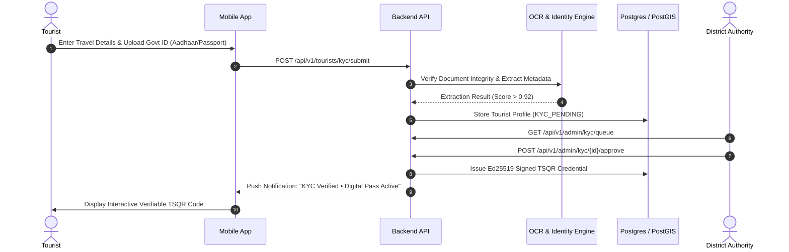
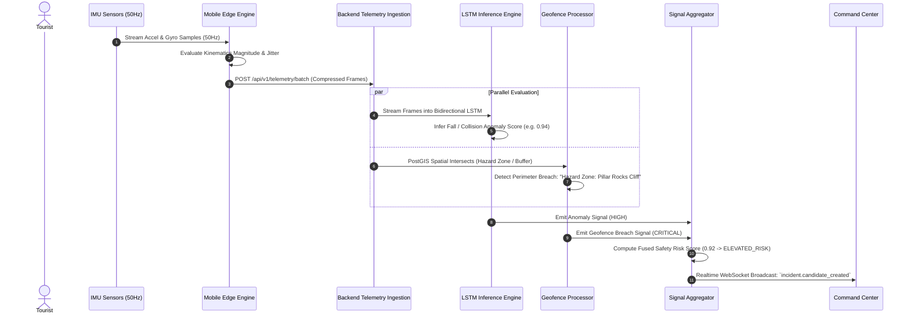
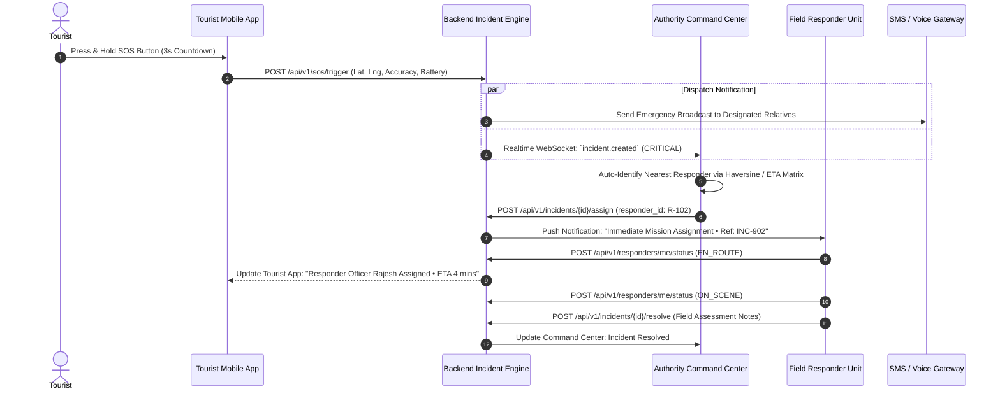
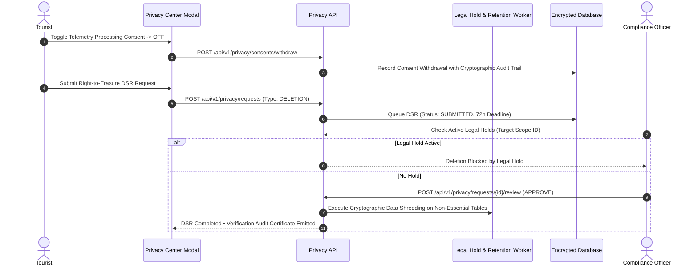

# TourSafe Operational Workflows & Playbooks

This document specifies the end-to-end operational workflows implemented across the TourSafe B2G Government Safety platform.

---

## 1. Tourist Identity & Verification Workflow (KYC → TSQR Credential)

---

## 2. High-Frequency Anomaly Detection & Signal Fusion Workflow

---

## 3. Emergency SOS & Multi-Agency Dispatch Lifecycle

---

## 4. Sovereign Privacy Management (DPDP Act 2023 / GDPR DSR)

