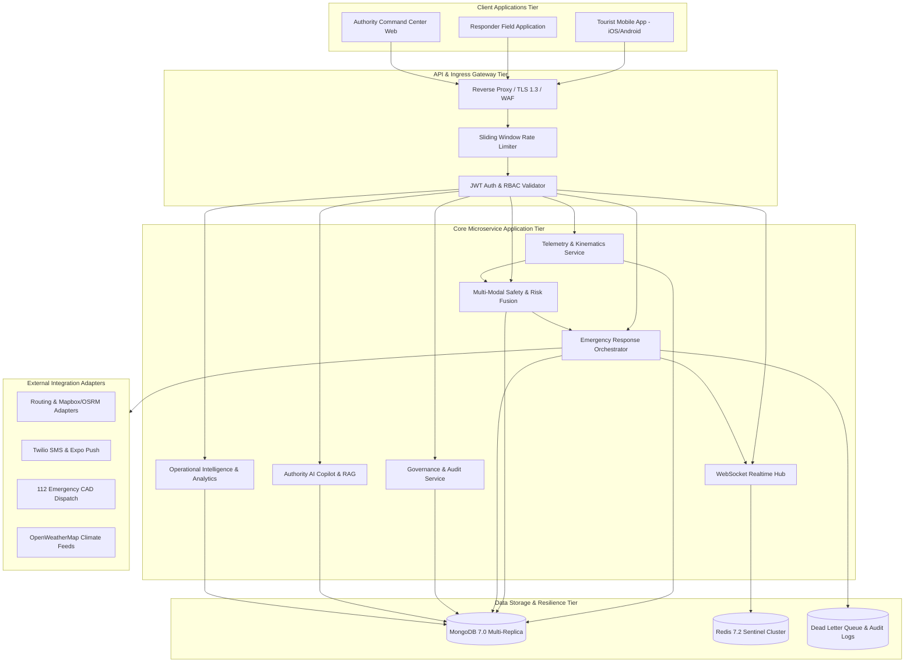

# TourSafe — Final System Architecture Map

## 1. System High-Level Architecture

TourSafe is an enterprise-grade tourist safety, risk telemetry, incident response, and emergency orchestration ecosystem built with resilient async pipelines, strict cryptographic auditing, and deterministic safety state machines.

---

## 2. Architectural Principles & Invariants
1. **Zero Silent Drops**: Every signal, action, and notification is acknowledged or escalated to dead-letter queues.
2. **Idempotency by Design**: All mutating state endpoints require unique idempotency keys (`client_request_id`).
3. **Deterministic Safety State Machine**: Direct uncorroborated state jumps to emergency states are strictly prevented.
4. **Separation of Duties (SoD)**: Security and safety policy configurations cannot be approved by their author.
5. **Data Minimization & Privacy by Design**: Coordinate accuracy is minimized based on current operational context.
