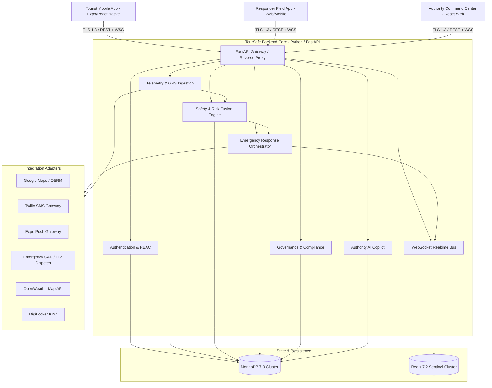

# TourSafe — Full System Integration Map

## 1. Executive Summary & Scope
This document provides the authoritative integration topology and interface contract mapping for the **TourSafe Platform (v1.0.0-rc1)**. It details the interconnects, protocols, serialization schemas, SLA guarantees, and fallback mechanisms across all 8 major subsystems.

---

## 2. Global Integration Topology

---

## 3. Subsystem Interconnects & Contracts

### 3.1 Tourist Mobile -> Ingress Pipeline
- **Transport**: HTTPS (REST API) & Secure WebSockets (`wss://api.toursafe.io/ws`).
- **Telemetry Batch Ingestion**:
  - Endpoint: `POST /api/v1/telemetry/samples` & `POST /api/v1/location/samples`
  - Payload: GPS (`lat`, `lon`, `accuracy`, `speed`, `altitude`, `timestamp`), IMU (`accel_x`, `accel_y`, `accel_z`, `gyro_x`, `gyro_y`, `gyro_z`).
  - Validation: Coordinate bounding box (`lat: [-90, 90]`, `lon: [-180, 180]`), speed sanity (`< 150 m/s`), monotonic sequence numbers.
  - Rate Limiting: 120 requests/minute per authenticated session.

### 3.2 Safety & Multi-Modal Risk Fusion Pipeline
- **Inputs**:
  1. IMU Kinematic Signals (Fall, crash, anomalous deceleration).
  2. Spatial/Geofence Signals (Restricted polygon entry, danger zone proximity).
  3. Itinerary Tracking (Deviation from registered travel schedule).
  4. Environmental Feeds (Weather alerts, high-tide curfews).
- **Processing**:
  - Deterministic Rule Engine evaluates 9 canonical rules.
  - Multi-Layer Risk Fusion calculates composite score:
    $$\text{Score} = (0.30 \cdot M + 0.28 \cdot S + 0.16 \cdot I + 0.14 \cdot E + 0.12 \cdot V) \times \text{Synergy}$$
  - State Machine Transitions: `NORMAL` $\to$ `WATCH` $\to$ `ELEVATED` $\to$ `INCIDENT_CANDIDATE` $\to$ `INCIDENT` $\to$ `RESOLVED`.
- **Outputs**: Automated SOS trigger, proactive tourist safety check notification, or authority alert broadcast.

### 3.3 Emergency Response Orchestration & Dispatch
- **Initiation**: Triggered on `SOS_SUBMITTED` or `SAFETY_STATE_INCIDENT`.
- **Idempotency**: Enforced by `client_request_id` and atomic deduplication locks.
- **Workflow State Machine**:
  - Stage 0: Nearest responder unit search & assignment (Radius: 5-15km).
  - Stage 1: Acknowledgement timeout sweep (180s timer). Redispatch if unacknowledged.
  - Stage 2: Proximity tracking (Geofence arrival trigger $< 500\text{m}$).
  - Stage 3: Supervisor escalation if 2 consecutive responder failures occur.
- **Fallback**: Fallback to Emergency CAD (112) adapter if no responder units are active.

### 3.4 Authority AI Copilot & Real-Time RAG
- **Model**: Multi-layer LLM provider with fallback abstraction (Gemini / Anthropic / Local ONNX).
- **Retrieval Augmented Generation (RAG)**:
  - Vector indexing on approved SOPs, emergency policies, and jurisdiction guidelines.
  - Strict Jurisdiction Filter: Documents scoped to jurisdiction $\alpha$ cannot leak to operator in jurisdiction $\beta$.
  - Retired Document Filter: Retired policy revisions are strictly excluded from runtime context.
- **Human-in-the-Loop Action Framework**:
  - Copilot proposes actions (e.g. `reassign_responder`, `broadcast_evacuation_alert`).
  - Actions issue cryptographic 15-minute confirmation tokens. Execution requires explicit operator confirmation.

---

## 4. Cross-Service Resilience & Circuit Breakers

| Adapter / Link | Timeout (ms) | Max Retries | Backoff Strategy | Circuit Breaker Threshold | Fallback Behavior |
| :--- | :--- | :--- | :--- | :--- | :--- |
| **Maps Routing** | 2500ms | 3 | Exponential ($2^n \times 100\text{ms}$) | 5 consecutive failures / 30s | Haversine direct line estimation |
| **SMS Gateway (Twilio)** | 3000ms | 2 | Exponential ($2^n \times 200\text{ms}$) | 3 consecutive failures / 60s | In-app Push Notification fallback |
| **Push Gateway (Expo)** | 2500ms | 3 | Exponential ($2^n \times 150\text{ms}$) | 5 consecutive failures / 60s | SMS alert fallback |
| **Emergency CAD** | 4000ms | 3 | Linear ($500\text{ms}$) | 3 consecutive failures / 30s | Queue in DLQ & trigger priority alarm |
| **Weather API** | 2000ms | 2 | Exponential ($2^n \times 100\text{ms}$) | 5 consecutive failures / 60s | Cached climate baseline data |

---

## 5. Security & Privacy Contracts

1. **Authentication**:
   - RFC 7519 JSON Web Tokens (JWT) signed with HMAC-SHA256.
   - Dual-token architecture: Access Token (15 min TTL) + Refresh Token (7 day TTL with reuse detection).
   - JTI-based immediate token revocation and session blacklisting.

2. **Data Minimization & Coordinate Obfuscation**:
   - `EMERGENCY` / `ACTIVE_SOS`: Exact 6-decimal coordinates ($\pm 0.11\text{m}$).
   - `ACTIVE_TRACKING`: 4-decimal coordinates ($\pm 11.1\text{m}$).
   - `GENERAL_ANALYTICS`: Geohash Level 6 truncation ($\pm 610\text{m}$) with $k$-anonymity suppression ($k \ge 5$).

3. **Audit Trail Cryptographic Hashing**:
   - All authority actions and configuration activations generate SHA-256 hash-chained immutable audit records.
   - Tamper-detection sweeps verify hash integrity on scheduled intervals.
