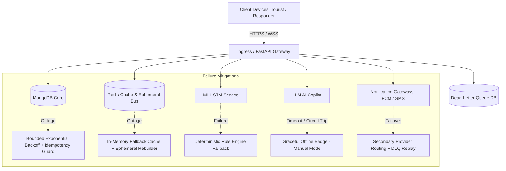

# TourSafe Platform Reliability Architecture

## 1. System Overview & Safety Scope
TourSafe is an emergency and safety-critical management platform supporting tourists, field responders, and authority command centers. The architectural core principle is **Strict Life-Safety Isolation**: failures, saturation, or outages in auxiliary services (such as Generative AI Copilots, predictive forecasting, or rich analytical heatmaps) must **never** impede the critical path:
- SOS Trigger Reception
- Incident Creation & Lifecycle
- Responder Tasking & Dispatch
- Critical Push/SMS/Radio Alerts
- Live GPS/IMU Telemetry Ingestion

---

## 2. Priority Hierarchy & Failure Priority
When system resources (CPU, Memory, Database IOPS, Network bandwidth) are constrained, TourSafe enforces priority-based execution:

| Priority Tier | Subsystems / Endpoints | Rationale & Degradation Policy |
| :--- | :--- | :--- |
| **CRITICAL** | SOS, Incident lifecycle, Dispatches, Telemetry Ingestion, Emergency Notifications | Never shed; unlimited retry queue; dedicated memory buffers; fallback persistence. |
| **HIGH** | Geofence zone checks, Real-time WebSocket map streaming, Incident chat | Retried with bounded backoff; buffered if bandwidth is saturated. |
| **NORMAL** | KYC checks, Tourist Itineraries, Device battery/health reporting | May experience queued delays during peak emergency loads. |
| **NON_CRITICAL** | AI Copilot (LLM queries), Anomaly forecasting, Analytical heatmaps, Weather enrichment | Shed immediately in `CRITICAL_ONLY` mode (HTTP 503 fast-fail with graceful client fallback). |

---

## 3. Failure Domain Inventory & Mitigations

| Failure Domain | Potential Impact | Recovery & Isolation Mechanism |
| :--- | :--- | :--- |
| **Application Process Crash** | Interrupted active requests | Container restart via orchestrator; liveness probe detects failure; stateless token validation; zero persistent state lost in worker. |
| **MongoDB Network / Primary Partition** | Write/Read failures | Exponential backoff retry with jitter; idempotency guards prevent duplicate incident creation upon network reconnect. |
| **Redis Cache / PubSub Loss** | Ephemeral cache miss, rate-limiter fallback | Automatic in-memory fallback cache takes over; state reconstructed from MongoDB upon Redis return. |
| **LSTM ML Inference Down** | Missing predictive anomaly score | Telemetry continues; safety state engine falls back to deterministic rule engine without fabricating scores. |
| **LLM Copilot Outage** | Automated incident summaries offline | Copilot returns `UNAVAILABLE`; command center continues manual dispatch seamlessly. |
| **Push Notification Provider Blackout** | Inability to deliver FCM push | Multi-provider fallback (SMS / Email / WebSocket direct broadcast); failed messages sent to durable Dead-Letter Queue (DLQ). |
| **Mobile Network Disconnect** | Telemetry and SOS offline on device | Local SQLite/AsyncStorage buffer on mobile; upon reconnect, buffered telemetry is synced with sequence deduplication and timestamp skew correction. |
| **Stale GPS Telemetry** | Stale location presentation | Coordinates older than 180 seconds are explicitly rendered as `LOCATION UNKNOWN` rather than misleading responders. |

---

## 4. Single-Region Reality & Operational Boundary
> [!IMPORTANT]
> TourSafe currently operates in a single primary cloud deployment region. We do **not** claim multi-region zero-downtime failover or multi-master replication until global database replication is provisioned. Operational recovery relies on automated container rescheduling, read-replica failovers, and verified snapshot restores.
