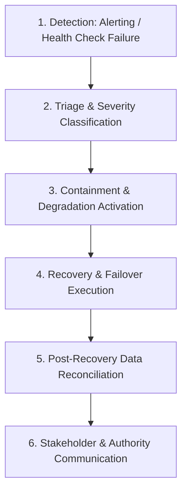

# TourSafe Disaster Recovery Plan & Incident Triage

## 1. Overview & Disaster Scenarios
Disaster Recovery (DR) outlines the exact protocols for responding to catastrophic infrastructure failures, data center blackouts, database corruption, or mass-scale network disruptions.

---

## 2. Disaster Triage & Escalation Workflow

### Phase 1: Detection
- Immediate alert fired by `/health/ready` or `/api/v1/reliability/slo` threshold breaches.
- Automated P0 notification dispatched to Lead SRE and Command Center Director.

### Phase 2: Triage & Classification
- **P0 - Catastrophic**: MongoDB total failure, SOS ingestion blackout, corruption of core safety database.
- **P1 - Major Outage**: Redis failure, push notification gateway down, real-time map offline.
- **P2 - Degraded**: AI Copilot down, ML inference offline, non-vital integrations failing.

### Phase 3: Containment
- Activate `CRITICAL_ONLY` mode to protect remaining CPU and memory resources.
- Switch client traffic to read-only or in-memory fallback caches.

### Phase 4: Recovery Execution
- Refer to component-specific runbooks:
  - Database: `docs/reliability/database-recovery.md`
  - Redis: `docs/reliability/redis-recovery.md`
  - Queue / DLQ: `docs/reliability/queue-recovery.md`

### Phase 5: Validation & Consistency Reconciliation
- Run `/api/v1/reliability/chaos/run` and verify consistency across incident states.
- Ensure all offline buffered mobile telemetry is re-ingested with sequence checks.

### Phase 6: Post-Incident Review & Communication
- Record incident timeline via `GET /api/v1/reliability/incidents/{id}/timeline`.
- Publish Root Cause Analysis (RCA) and audit log review within 24 hours.
