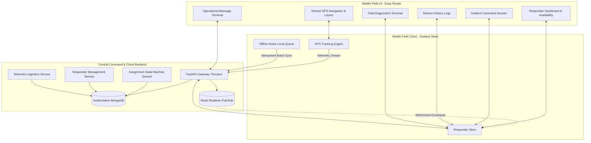
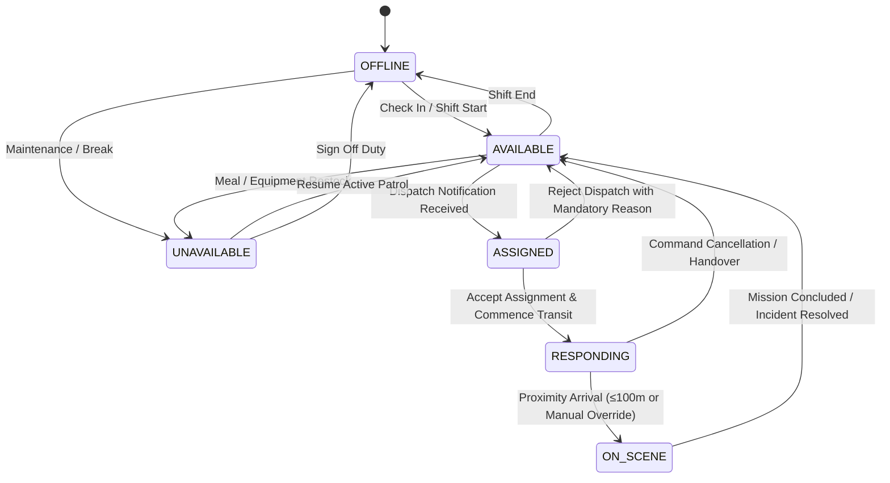

# TourSafe Responder Mobile Application & Tactical Field Operations Architecture

## 1. Executive Summary & Operational Mission
TourSafe Responder is a specialized, security-hardened mobile client tailored specifically for tactical field operations, mountain rescue teams, coastal lifeguards, medical first responders, and tourism police. 

Unlike consumer or back-office dashboard applications, this platform is strictly built for high-stress operational environments:
- **Backend Authority**: The central FastAPI/MongoDB/Redis engine is strictly authoritative for incident states, assignment lifecycles, eligibility scoring, safety geofence states, and permission controls.
- **Privacy Minimization**: Responders receive strictly minimized tourist situational context (geocoordinates, reported distress category, last verified safety status, and vital triage flags). Responders do not receive raw KYC documents or sensitive PII.
- **Offline Field Mode**: In remote terrain or signal dead-zones, responders can record timestamped field notes and triage assessments. All actions are queued locally in persistent storage and automatically reconciled upon reconnection with cryptographic deduplication.

---

## 2. System Architecture Diagram

---

## 3. Strict Finite State Machine Lifecycle

### 3.1 Responder Availability States

### 3.2 Incident Assignment Lifecycle
1. **PENDING**: Dispatch generated by Authority Command or Automated Geofence Engine. Targeted unit notified via realtime WebSocket push.
2. **ACCEPTED / REJECTED**: Responder has operational decision authority to accept or reject with structured reasons (`UNREACHABLE_OR_OFFLINE`, `INSUFFICIENT_CAPABILITY`, `EQUIPMENT_MALFUNCTION`, `GEOGRAPHIC_BARRIER`, `SAFETY_HAZARD`, `CONCURRENT_ACTIVE_RESPONSE`, `OTHER`).
3. **ACTIVE (RESPONDING)**: Responder is actively en route. High-frequency GPS telemetry broadcasts live vector (lat, lon, speed, bearing, battery).
4. **ON_SCENE**: Verified via true Haversine geodesic distance calculation (≤100m) with auditable manual override. Structured scene assessment (`TOURIST_SAFE`, `FIRST_AID_RENDERED`, `MEDICAL_ASSISTANCE`, `EVACUATION_REQUIRED`, etc.) submitted to timeline.
5. **COMPLETED / HANDOVER**: Resolution documented with auditable reasons and responder released back to `AVAILABLE`.

---

## 4. Offline Field Synchronization Protocol

When a responder operates in cellular dead-zones (e.g. dense jungle, deep valley, or marine zone):
1. **Local Enqueueing**: Tactical field notes and observations are assigned a client-generated UUID (`cnote_...`), timestamped, tagged with last known GPS coordinates, and stored in persistent AsyncStorage.
2. **Reconnection Trigger**: As soon as HTTP/WebSocket connectivity is restored, the `useResponderStore` initiates batch sync via `POST /api/v1/responders/me/field-notes/sync`.
3. **Backend Deduplication**: The backend checks `client_note_id` against the incident notes list. Duplicate transmissions are safely ignored (idempotent), while new entries are appended to the authoritative incident record and timeline audit feed.
