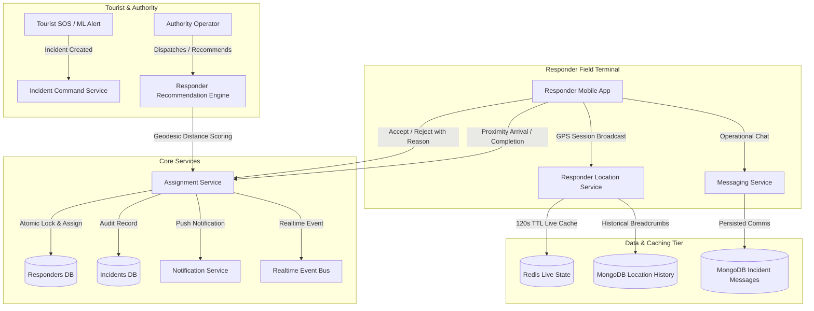

# TourSafe Responder Operations Platform & Incident Command Architecture

## 1. System Overview

The **TourSafe Responder Operations Platform** establishes the live field response layer connecting **Tourist Distress Signals (Manual SOS / ML Anomaly Detection)**, **Authority Dispatch Command**, and **Field Responders / Emergency Units**.

The platform is built on strict operational principles:
- **No autonomous dispatch or fake ETA predictions**: All responder assignments, dispatch recommendations, and status transitions are deterministic and backed by real geographic geodesics (Haversine formula).
- **Physical Proximity Verification**: Arrival at the scene requires GPS verification within a configurable 500-meter threshold, with explicit auditable manual override logging when GPS signal degradation occurs.
- **Strict State Machines**: Both Responders and Units operate on strict, validated state transition matrices with optimistic / atomic database locking to prevent concurrent double-assignments.
- **Durable Live & Persistent Telemetry**: GPS tracking uses a dual-tier storage strategy (Redis volatile cache with 120s TTL for real-time dispatch queries + MongoDB time-series history for immutable audit trails and post-incident investigation).

---

## 2. Architecture & Component Interaction

---

## 3. Data Models & Schemas

### 3.1 Responder Types & Statuses
- **Types**: `POLICE`, `MEDICAL`, `FIRE`, `SEARCH_AND_RESCUE`, `SECURITY`, `FIELD_RESPONDER`, `AUTHORITY_OPERATOR`.
- **Responder Status Machine**:
  - `OFFLINE` $\rightarrow$ `AVAILABLE`
  - `AVAILABLE` $\rightarrow$ `ASSIGNED` | `UNAVAILABLE` | `OFFLINE`
  - `ASSIGNED` $\rightarrow$ `RESPONDING` | `AVAILABLE` (if rejected/cancelled)
  - `RESPONDING` $\rightarrow$ `ON_SCENE` | `AVAILABLE` (if cancelled)
  - `ON_SCENE` $\rightarrow$ `AVAILABLE` | `UNAVAILABLE`
  - `UNAVAILABLE` $\rightarrow$ `AVAILABLE` | `OFFLINE`

### 3.2 Unit Status Machine
- `ACTIVE` $\rightarrow$ `STANDBY` | `DISPATCHED` | `OUT_OF_SERVICE`
- `STANDBY` $\rightarrow$ `ACTIVE` | `DISPATCHED` | `OUT_OF_SERVICE`
- `DISPATCHED` $\rightarrow$ `ACTIVE` | `STANDBY` | `OUT_OF_SERVICE`
- `OUT_OF_SERVICE` $\rightarrow$ `ACTIVE` | `STANDBY`

### 3.3 Assignment Lifecycle
- `PENDING` $\rightarrow$ `ACCEPTED` | `REJECTED` | `CANCELLED`
- `ACCEPTED` $\rightarrow$ `ACTIVE` (Started response) | `CANCELLED`
- `ACTIVE` $\rightarrow$ `ON_SCENE` | `COMPLETED` | `CANCELLED`
- `ON_SCENE` $\rightarrow$ `COMPLETED` | `CANCELLED`

---

## 4. Responder Recommendation Engine

Dispatch recommendations calculate true geodesic distance from incident coordinates:
$$d = 2R \arcsin\left(\sqrt{\sin^2\left(\frac{\Delta\phi}{2}\right) + \cos\phi_1\cos\phi_2\sin^2\left(\frac{\Delta\lambda}{2}\right)}\right)$$
where $R = 6371000\text{ m}$.

### Scoring Matrix:
1. **Base Score**: 100 points for active `AVAILABLE` responders.
2. **Proximity Score**: Deducts 1.5 points per kilometer of distance from scene.
3. **Capability Matching**: +15 points for matching specialized capabilities (`MEDICAL`, `MOUNTAIN_RESCUE`, `SEARCH_AND_RESCUE`, `POLICE`).
4. **GPS Freshness**:
   - `LIVE` ($\le 60\text{s}$): +10 bonus points.
   - `RECENT` ($60\text{s} - 300\text{s}$): 0 points.
   - `STALE` ($300\text{s} - 900\text{s}$): -20 points.
   - `OFFLINE` ($> 900\text{s}$ or no fix): -40 points.

---

## 5. Security, Anti-Concurrency & Verification

1. **Atomic Concurrency Locking**: Responders are claimed via `find_one_and_update` matching `status == 'AVAILABLE'` and `active_assignment_id == null`. Concurrent double-assignments fail cleanly with 400 Bad Request.
2. **Arrival Proximity Gate**: `mark_arrived` checks distance $\le 500\text{m}$. If GPS is jittery or unavailable, `force_override: true` is accepted with explicit audit logging of reason and accuracy.
3. **Mandatory Rejection & Completion Reasons**: Responders cannot dismiss or close assignments without auditable standardized reasons (`UNREACHABLE_OR_OFFLINE`, `INSUFFICIENT_CAPABILITY`, `EQUIPMENT_MALFUNCTION`, `GEOGRAPHIC_BARRIER`, `SAFETY_HAZARD`, `CONCURRENT_ACTIVE_RESPONSE`, etc.).
