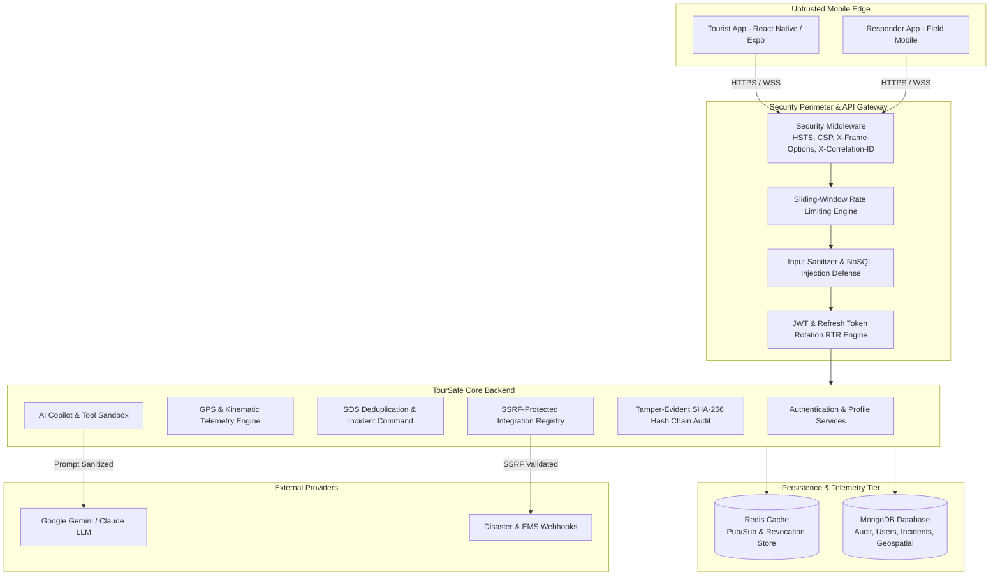

# TourSafe Security Architecture & Component Inventory

## 1. System Overview & Trust Boundaries
TourSafe is an enterprise-grade tourist safety and emergency response orchestration platform. It operates across multiple trust boundaries:
- **Untrusted Mobile Edge**: Tourist mobile application (Expo/React Native) and Responder Field application transmitting sensor telemetry, GPS breadcrumbs, and emergency SOS requests over cellular/public networks.
- **Controlled Ingestion & API Boundary**: FastAPI backend behind TLS termination, Defense-in-Depth Security Middleware, and sliding-window Rate Limiters.
- **Core Persistence & Cache**: MongoDB 7.0 (geospatial indexes, versioned governance config, immutable audit log) and Redis 7.0 (live telemetry windows, pub/sub realtime bus, token revocation store).
- **AI Intelligence & Copilot**: Google Gemini / Claude LLM integration wrapped with prompt injection defenses, PII redaction, tool sandboxing, and two-phase action verification tokens.
- **External Third-Party Integrations**: SMS/Twilio, Webhooks, Push Notifications (Expo/FCM), Hospital EMS dispatch, and National Disaster Management feeds via SSRF-shielded adapters.

---

## 2. Asset Inventory & Data Classification

| Asset Category | Classification | Encryption in Transit | Encryption at Rest | Access Control / ABAC |
| :--- | :--- | :--- | :--- | :--- |
| **Tourist Identity & KYC** | `SENSITIVE` / `CONFIDENTIAL` | TLS 1.3 | AES-256 (MongoDB Volume) | Owner Tourist, Verified Authority Officer |
| **Live GPS Coordinates** | `SENSITIVE` | TLS 1.3 (WSS / HTTPS) | Ephemeral Redis TTL (120s) | Owner Tourist, Jurisdictional Command Center |
| **GPS Breadcrumb History** | `CONFIDENTIAL` | TLS 1.3 | MongoDB Encrypted Storage | Tourist Profile Owner, Assigned Incident Officers |
| **IMU Telemetry Windows** | `INTERNAL` | TLS 1.3 | MongoDB / Redis Pipeline | Safety Engine, ML Inference Pipeline |
| **SOS Triggers & Incidents** | `CRITICAL` | TLS 1.3 | MongoDB Persistent Storage | Tourist, Assigned Field Responders, Command Operators |
| **JWT Access & Refresh Tokens**| `CRITICAL` | TLS 1.3 (HTTPS Only) | Argon2id & In-Memory / Redis Revocation Store | Cryptographic Signature (HS256 >= 32-byte secret) |
| **Authority Governance & Policies**| `CONFIDENTIAL` | TLS 1.3 | MongoDB Versioned Records | Authority Admin, System Admin (Separation of Duties) |
| **System Audit Logs** | `CRITICAL` | TLS 1.3 | SHA-256 Cryptographic Hash Chaining | Read-Only to System Admins; Strictly Immutable |
| **ML Model Artifacts** | `INTERNAL` | TLS 1.3 | Filesystem with SHA-256 Checksums | ML Training Pipeline & Model Registry |

---

## 3. Data Flow Architecture

