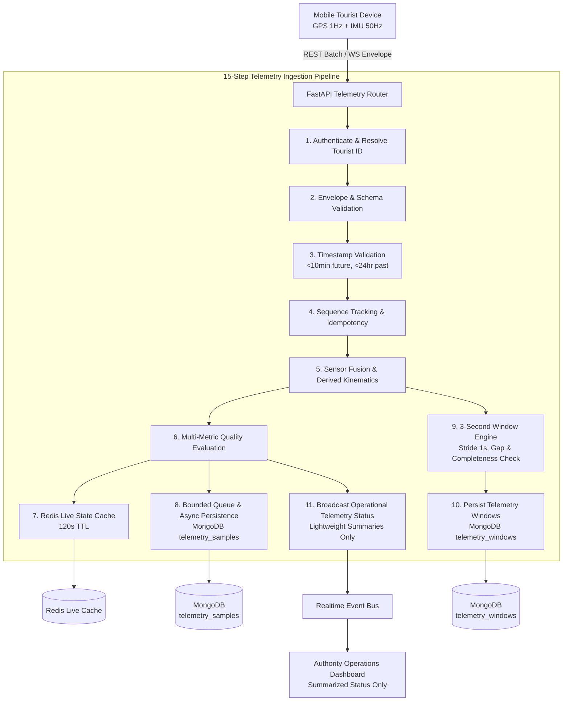

# TourSafe - Real Telemetry Ingestion & Storage Pipeline Architecture

## 1. System Overview

The TourSafe Telemetry Ingestion Pipeline provides high-throughput, low-latency, resilient sensor and geospatial data processing for mobile tourist safety. It processes 50 Hz IMU (accelerometer, gyroscope, derived kinematics) and ~1 Hz GPS location streams, delivering:

1. **Strict Monotonic Sequence Tracking & Idempotency** (zero duplicate processing, gap detection)
2. **Dual-Tier State Management** (sub-millisecond Redis live state + durable MongoDB persistence)
3. **Temporal Window Engine** (3.0s sliding windows with 1.0s stride, completeness evaluation, gap checking)
4. **Sensor Synchronization & Alignment** (IMU + GPS temporal association without synthetic point fabrication)
5. **Bounded Backpressure & Local Offline Buffering** (AsyncStorage mobile queue with automatic replay)
6. **Operational Privacy** (lightweight summarized telemetry events for authorities; raw 50 Hz IMU is never broadcast to operational dashboards)



---

## 2. Canonical Telemetry Data Models

### 2.1 Telemetry Packet Envelope (`TelemetryPacketEnvelope`)
```json
{
  "packet_id": "pkt_sess1_42_1740000000000",
  "packet_type": "telemetry.sample",
  "session_id": "tsess_9b83f01c",
  "sequence_number": 42,
  "timestamp": "2026-08-21T14:00:00.120Z",
  "is_background": false,
  "payload": {
    "latitude": 10.2381,
    "longitude": 77.4892,
    "accuracy": 4.5,
    "accelerometer": { "x": 0.02, "y": -0.01, "z": 0.98 },
    "gyroscope": { "x": 0.001, "y": 0.002, "z": -0.001 }
  }
}
```

### 2.2 Telemetry Sample (`TelemetrySample`)
Persisted to `telemetry_samples` in MongoDB with 2dsphere indexing and compound unique index `(session_id, sequence_number)`:
- `packet_id`: Unique string
- `tourist_id`: Resolved from JWT
- `user_id`: Authenticated user
- `sequence_number`: Monotonic integer
- `timestamp`: UTC ISO string
- `received_at`: Server timestamp
- `derived`: Kinematics (acceleration magnitude, jerk, angular velocity)
- `gps`: Validated coordinates + accuracy
- `accelerometer`: Triaxial acceleration
- `gyroscope`: Triaxial angular rate

### 2.3 Telemetry Window (`TelemetryWindow`)
Produced for downstream AI / ML feature extraction:
- `duration_seconds`: `3.0`
- `nominal_frequency_hz`: `50.0`
- `actual_frequency_hz`: Observed sample rate
- `completeness_ratio`: `observed / nominal` (valid if >= 0.6)
- `is_valid`: Boolean (valid completeness, monotonic timestamps, gap <= 250ms)
- `validation_errors`: Array of reasons if invalid
- `max_gap_duration_ms`: Maximum gap detected between successive samples
- `gps_context`: Nearest valid GPS point during the 3-second span
- `mean_accel_magnitude`, `max_accel_magnitude`, `mean_gyro_magnitude`, `max_gyro_magnitude`

---

## 3. Sequence Management & Idempotency

Each session maintains:
1. `highest_sequence`: Highest sequence number received
2. `highest_contiguous_sequence`: Continuous watermark without gaps
3. `received_sequences`: Bounded set of observed sequence numbers
4. `seen_packet_ids`: Bounded set of UUIDs
5. `duplicate_packets`: Count of duplicate packet transmissions

**Acknowledgment Protocol:**
- Server returns `TelemetryAck` containing:
  - `status`: `accepted` | `duplicate` | `out_of_order` | `rejected`
  - `highest_contiguous_sequence`: Client uses this watermark to safely prune local offline buffers.

---

## 4. Dual-Tier Storage & Caching

### 4.1 Redis Live State (`TelemetryRedisStateManager`)
- `toursafe:telemetry:live:{tourist_id}`: Latest tourist telemetry snapshot (TTL: 120s)
- `toursafe:telemetry:session:{session_id}`: Active session state
- `toursafe:telemetry:quality:{session_id}`: Current composite quality
- **Degraded Fallback**: If Redis is offline, system seamlessly degrades to an in-memory TTL store without dropping samples or delaying responses.

### 4.2 MongoDB Durable Persistence (`TelemetryPersistenceManager`)
- `telemetry_samples`: Indexed on `packet_id` (unique), `(session_id, sequence_number)` (unique), `(tourist_id, timestamp)`, `location` (2dsphere).
- `telemetry_windows`: Indexed on `window_id` (unique), `(session_id, window_start)`, `(tourist_id, window_start)`.
- `telemetry_sessions`: Indexed on `session_id` (unique), `(tourist_id, started_at)`.
- **Retention Policy**: `apply_retention_policy()` purges records older than `TELEMETRY_RETENTION_DAYS` (default 30 days).

---

## 5. Offline Buffering & Backpressure Strategy

1. **Client Bounded FIFO Buffer**: `frontend/lib/telemetry/offlineBuffer.ts` holds up to 5,000 packets (~100s of 50 Hz IMU or 1.4 hours of 1 Hz GPS) in AsyncStorage.
2. **Reconnection Replay**: When network connectivity returns, `telemetryClient` drains batches of 50 packets to `/api/v1/telemetry/batch`.
3. **Contiguous Buffer Pruning**: The server `highest_contiguous_sequence` ack response safely deletes confirmed packets from local storage.
4. **Backend Ingestion Queue**: `TelemetryIngestionQueue` buffers incoming packets in a bounded 5,000 item asyncio queue, decoupling HTTP/WS ingestion latency from database write latency.

---

## 6. Authority Monitoring & Operational Privacy

Authorities view operational summaries (`/api/v1/authority/tourists/{tourist_id}/telemetry-status`) including:
- Tracking status (`active`, `paused`, `stopped`)
- Last telemetry and location timestamps
- GPS Quality, IMU Quality, Overall Composite Quality
- Connection state (`active`, `stale`, `offline`)

**Privacy Guarantee**: Raw 50 Hz IMU sensor streams (`accelerometer`, `gyroscope`, fine-grained kinematics) are strictly restricted from authority channels and operational screens to conserve bandwidth and prevent surveillance overreach.
