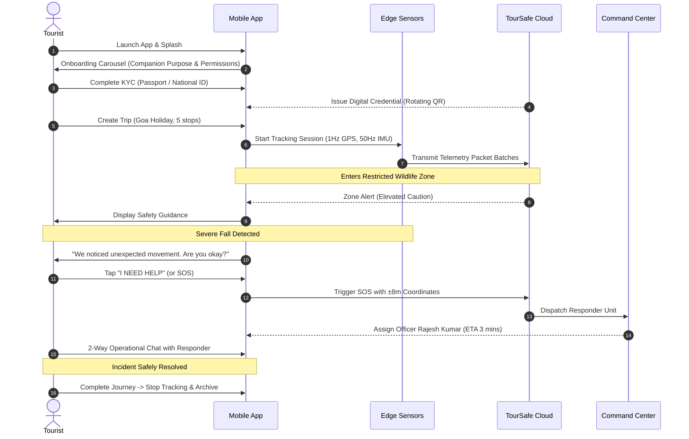

# TourSafe Tourist Mobile UX & Journey Specification

## 1. Design Philosophy: A Safety Companion, Not a Surveillance Tool
TourSafe is purposefully constructed as a **reassuring personal travel companion**. Travelers are never presented with intimidating surveillance telemetry or raw AI inference metrics. Instead, the interface focuses on clarity, user agency, and human explanations.

### Core UX Principles:
1. **Unambiguous Transparency**: The user always knows:
   - What data is being gathered (GPS coordinates, motion telemetry).
   - Why it is being gathered (zone alerts, fall detection, emergency dispatch).
   - Whether tracking is actively running or stopped.
   - Whether telemetry is synced or stored offline.
2. **Actionable, Human Language**:
   - ❌ *"IMU autoencoder reconstructed anomaly score 0.89 above threshold."*
   - ✅ *"We noticed unusual movement. Are you okay?"*
   - ❌ *"GEOFENCE_VIOLATION_ERR_403"*
   - ✅ *"You entered North Wildlife Buffer. Please stay on marked paths."*
3. **Preventing Alarm Fatigue & False Positives**:
   - Deliberate 5-second countdown on SOS prevents pocket dials.
   - Two-option anomaly confirmation ("YES, I'M SAFE" / "I NEED HELP") allows tourists to quickly dismiss false alarms.

---

## 2. The 8 Home Dashboard Contextual States

The TourSafe Home Dashboard dynamically transitions between 8 authoritative states:

| State | Primary UI Banner | Primary Action | Secondary Actions |
|---|---|---|---|
| **NO ACTIVE TRIP** | Blue guide card: "No Active Trip in Progress" | "Plan New Trip" button | Digital ID QR, Safety Settings |
| **ACTIVE TRIP** | Destination hero card, dates, next waypoint | "End Trip" / Waypoint detail | SOS quick button, Live GPS status |
| **TRACKING ACTIVE** | Pulsating green beacon, ±accuracy meters, 50 Hz IMU streaming | "Pause Tracking" | Center on Map, Live Waypoints |
| **TRACKING OFF** | Slate status badge: "Tracking Paused" | "Start Tracking" | Safety settings, Digital ID |
| **OFFLINE** | Amber banner: "Offline Resilience Active — FIFO buffer syncing" | Access cached itinerary | Offline SOS dispatch |
| **SAFETY ALERT** | Warning banner (amber/red): Zone or weather caution | "View Guidance" / "Confirm Safe" | Regional emergency helpline |
| **ACTIVE INCIDENT** | Crimson alert card: "Emergency Assistance Dispatched" | "Open Incident Command & Chat" | Assigned responder info, Call 112 |
| **SOS ACTIVE** | Pulsing emergency red card: "SOS Broadcast Active" | 2-Way Operational Messaging | Cancel SOS with reason modal |

---

## 3. End-to-End Traveler Experience Flow

---

## 4. Emergency & Incident Communication Architecture
- **Distinction of Messaging**:
  - System Dispatch Notices (automated system alerts in dark slate).
  - Authority Command Broadcasts (amber authority badge).
  - First Responder Messages (cyan unit badge with name and unit ID).
  - Tourist Messages (blue right-aligned bubbles with delivery timestamps).
- **Incident Timeline**: Real-time progress bar visualizing:
  1. Distress Beacon Received
  2. Authority Command Acknowledged
  3. Responder Unit Assigned
  4. Responder Unit En Route (with live ETA)
  5. On-Scene Arrival
  6. Incident Resolved

---

## 5. Offline Experience & Sync
When traveling in remote areas or national parks with no cellular signal:
1. An offline banner reassuringly informs the tourist: *"Telemetry is buffered securely on-device and will sync automatically when your connection returns."*
2. Itinerary stops and cached digital credentials remain fully viewable.
3. SOS can still be pressed; the dispatch is signed with a local timestamp and queued for immediate burst transmission upon network reconnection.
